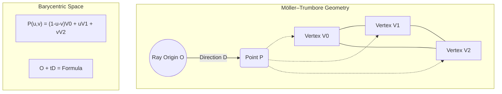

# Mathematical and Physical Foundations

This document details the mathematical principles and physics simulations that power the Skewer rendering engine and the Loom deep compositor. Each section explains the theory and points to the exact implementation in our codebase.

---

## 1. Geometric Foundations & Linear Algebra

### 1.1 Vector Operations
Most of our spatial calculations rely on standard 3D vector algebra.

*   **Dot Product ($A \cdot B$):** Used to calculate the cosine of the angle between vectors, essential for Lambertian shading and visibility checks.

*   **Cross Product ($A \times B$):** Used to generate orthogonal vectors, such as calculating surface normals from triangle edges.

*   **Implementation:** `skewer/src/core/math/vec3.h`

### 1.2 Transformations & Quaternions
We use a **TRS (Translation, Rotation, Scale)** system to place objects in the world.

*   **Quaternions:** Used for rotations to avoid gimbal lock and ensure smooth animation interpolation.

*   **SLERP (Spherical Linear Interpolation):** Used to interpolate between two rotation keyframes along the shortest path on a 4D unit sphere.

*   **Implementation:** `skewer/src/core/math/transform.h`, `skewer/src/core/math/quat.h`

### 1.3 Orthonormal Basis (ONB)
To sample directions on a surface, we construct a local coordinate system (tangent space) where the surface normal is the Z-axis.

*   **Application:** When a ray hits a surface, we use an ONB to transform a randomly sampled "hemisphere" direction back into world space.

*   **Implementation:** `skewer/src/core/math/onb.h`

---

## 2. Intersection Algorithms

### 2.1 Ray-Triangle (Möller–Trumbore)
The engine uses the Möller–Trumbore algorithm, which solves for the intersection using barycentric coordinates ($u, v$) without needing to pre-calculate the plane equation.

*   **Application:** Core primitive intersection for all 3D meshes.
*   **Implementation:** `skewer/src/geometry/intersect_triangle.h`

### 2.2 Ray-Sphere
Intersections are found by solving the quadratic equation:
$$
t^2(d \cdot d) + 2t(d \cdot (o - c)) + (o - c) \cdot (o - c) - r^2 = 0
$$
where $o$ is the ray origin, $d$ is the direction, $c$ is the sphere center, and $r$ is the radius.

* **Implementation:** `skewer/src/geometry/intersect_sphere.h`

### 2.3 Ray-AABB (Slab Method)
Bounding box intersections use the "Slab Method," which checks the overlap of three 1D intervals (the "slabs" between the box's parallel faces).

<figure align="center">
  <svg width="400" height="220" viewBox="0 0 400 220" xmlns="http://www.w3.org/2000/svg">
    <rect x="120" y="60" width="160" height="100" fill="none" stroke="#666" stroke-width="2" stroke-dasharray="4"/>
    <line x1="40" y1="195" x2="360" y2="35" stroke="#ff5252" stroke-width="2" />
    <circle cx="120" cy="155" r="4" fill="#ff5252" />
    <circle cx="280" cy="75" r="4" fill="#ff5252" />
    <text x="130" y="175" fill="currentColor" font-size="12">t_min</text>
    <text x="290" y="95" fill="currentColor" font-size="12">t_max</text>
    <text x="165" y="105" fill="#888" font-size="14">AABB</text>
    <path d="M 40 210 L 360 210" stroke="currentColor" stroke-width="1" fill="none" />
    <polygon points="360,210 355,207 355,213" fill="currentColor" />
    <text x="370" y="215" fill="currentColor" font-size="12">t</text>
  </svg>
  <figcaption>Figure 1: Ray-AABB intersection via interval overlap.</figcaption>
</figure>

*   **Application:** Essential for traversing the **BVH (Bounding Volume Hierarchy)** and **TLAS** quickly.
*   **Implementation:** `skewer/src/geometry/boundbox.h`

---

## 3. Light & Surface Physics (BSDFs)

### 3.1 The Rendering Equation
The core of our path tracer is the evaluation of the Kajiya Rendering Equation:

$$
L_o(p, \omega_o) = L_e(p, \omega_o) + \int_{\mathcal{S}^2} f_r(p, \omega_i, \omega_o) L_i(p, \omega_i) \cos \theta_i \mathrm{d}\omega_i
$$

We use Monte Carlo integration to approximate this integral by tracing thousands of random paths.

*   **Implementation:** `skewer/src/kernels/path_kernel.cc`

### 3.2 GGX Microfacet BRDF
For metallic and rough surfaces, we use the Cook-Torrance model with the **GGX (Trowbridge-Reitz)** distribution. This model is preferred over older ones (like Beckmann) because its "long tails" better simulate the hazy glow around highlights.

<figure align="center">
  <svg width="400" height="150" viewBox="0 0 400 150" xmlns="http://www.w3.org/2000/svg">
    <path d="M 50 130 L 350 130" stroke="currentColor" stroke-width="1" />
    <path d="M 200 130 Q 200 20 220 100 T 350 125" stroke="#448aff" stroke-width="2" fill="none" />
    <path d="M 200 130 Q 200 20 180 100 T 50 125" stroke="#448aff" stroke-width="2" fill="none" />
    <text x="210" y="40" fill="#448aff" font-size="12">GGX (Long Tails)</text>
    <text x="200" y="145" fill="currentColor" font-size="10" text-anchor="middle">θ = 0 (Normal)</text>
  </svg>
</figure>

*   **$D$ (Normal Distribution):** Models the concentration of micro-mirrors aligned with the half-vector.
*   **$G$ (Shadowing-Masking):** Models how microfacets shadow each other at grazing angles (using Smith's approximation).
*   **Implementation:** `skewer/src/materials/bsdf.cc`

### 3.3 Dielectric Fresnel & Snell's Law
We model glass and water using exact Fresnel equations for reflectance ($F$) and Snell's Law for refraction.

*   **Dispersion:** We use **Cauchy's Equation** ($n(\lambda) = A + B/\lambda^2$) to make the Index of Refraction wavelength-dependent, creating "rainbow" prisms.

*   **Implementation:** `SampleDielectric` in `skewer/src/materials/bsdf.cc`

---

## 4. Participating Media (Volume Rendering)

### 4.1 Beer-Lambert Law
Light passing through a volume (like fog) is attenuated exponentially based on density and distance.

$$
T_r(d) = e^{-\sigma_t \cdot d}
$$

<figure align="center">
  <svg width="400" height="180" viewBox="0 0 400 180" xmlns="http://www.w3.org/2000/svg">
    <path d="M 50 150 L 350 150" stroke="currentColor" stroke-width="1" />
    <path d="M 50 150 L 50 30" stroke="currentColor" stroke-width="1" />
    <path d="M 50 30 C 150 30, 200 140, 350 145" stroke="#00c853" stroke-width="2" fill="none" />
    <text x="130" y="45" fill="#00c853" font-size="12">Transmittance</text>
    <text x="320" y="165" fill="currentColor" font-size="10">Distance (d)</text>
  </svg>
</figure>

*   **Implementation:** `SampleHomogeneous` in `skewer/src/kernels/sample_media.cc`

### 4.2 Woodcock Tracking (Delta Tracking)
To render non-uniform volumes (VDB clouds), we use Woodcock tracking. It uses a "majorant" (maximum density) to probabilistically decide whether a photon collides with a particle or passes through as a "null collision."

*   **Implementation:** `SampleNanoVDB` in `skewer/src/kernels/sample_media.cc`

### 4.3 Henyey-Greenstein Phase Function
Unlike surfaces that use BSDFs, volumes use **Phase Functions** to describe scattering. We implement the Henyey-Greenstein function to model anisotropic scattering (light bending forward or backward).

<figure align="center">
  <svg width="400" height="150" viewBox="0 0 400 150" xmlns="http://www.w3.org/2000/svg">
    <ellipse cx="230" cy="75" rx="60" ry="30" fill="none" stroke="#ffab40" stroke-width="2" />
    <circle cx="170" cy="75" r="5" fill="currentColor" />
    <path d="M 100 75 L 160 75" stroke="currentColor" stroke-width="1" stroke-dasharray="2"/>
    <text x="285" y="55" fill="#ffab40" font-size="12">Forward (g > 0)</text>
    <text x="130" y="90" fill="currentColor" font-size="10">Particle</text>
  </svg>
</figure>

*   **Implementation:** `skewer/src/kernels/utils/volume_tracking.cc`

---

## 5. Monte Carlo & Sampling

### 5.1 Multiple Importance Sampling (MIS)
To reduce noise, we combine two sampling techniques: **Next Event Estimation (NEE)** (sampling lights directly) and **BSDF Sampling** (following the material's physical properties). We weight them using the **Power Heuristic** ($\beta=2$):

$$
w_f(p) = \frac{f(p)^\beta}{f(p)^\beta + g(p)^\beta}
$$

*   **Implementation:** `skewer/src/core/sampling/sampling.h`

### 5.2 Hero Wavelength Sampling
For spectral rendering, we sample 4 wavelengths per ray. One is the "Hero," used to make discrete decisions (like reflecting vs refracting), while the others ("Companions") are evaluated at the same spatial path to minimize variance.

*   **Implementation:** `skewer/src/core/sampling/wavelength_sampler.h`

---

## 6. Animation Math

### 6.1 Cubic Bezier Interpolation
Animations follow Bezier paths. Since time ($u$) is linear but the curve parameter ($t$) is not, we use the **Newton-Raphson Method** to iteratively solve for $t$ such that $X(t) = u$.

*   **Implementation:** `skewer/src/scene/interp_curve.cc`

---

## 7. Deep Compositing (Loom)

### 7.1 Alpha Power Law
When Loom merges two volumetric layers, it must sometimes split a sample into two. To maintain physical correctness, the alpha of the new fragments is calculated using the power law.

```mermaid
gantt
    title Sample Splitting Logic (Z-depth)
    dateFormat  X
    axisFormat  %s
    section Layer A (Vol)
    Original Sample    :a1, 0, 50
    section Result
    Front Fragment (Split) :done, r1, 0, 25
    Back Fragment (Split)  :r2, 25, 50
```

$$
\alpha_{new} = 1 - (1 - \alpha_{orig})^{\frac{T_{new}}{T_{orig}}}
$$

This ensures the combined transmittance of the split fragments equals the original.

*   **Implementation:** `loom/src/deep_volume.cc`

### 7.2 The Over Operator
The final 2D image is generated by flattening deep pixels front-to-back using the recursive "Over" operator:

$$
C_{out} = C_{front} + (1 - \alpha_{front}) \cdot C_{back}
$$

*   **Implementation:** `FlattenRow` in `loom/src/deep_row.h`
