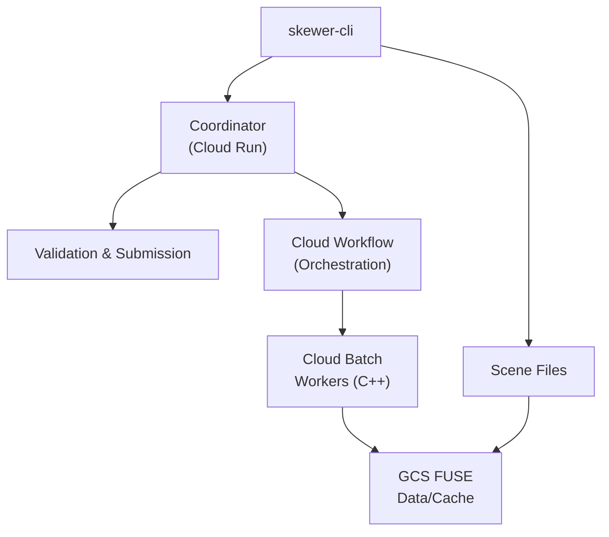
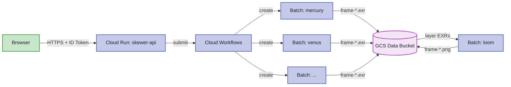
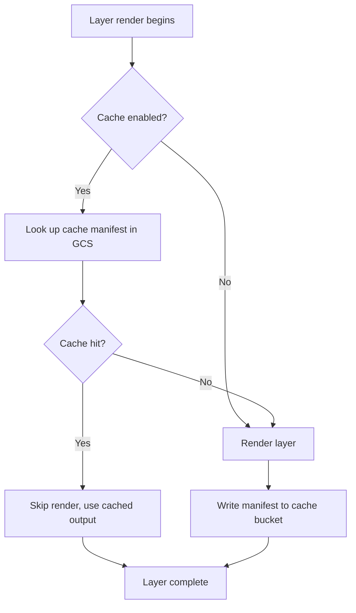

# Architecture Overview

Skewer is a serverless, distributed deep rendering system with three main components orchestrated on Google Cloud Platform:

## Components

| Component | Platform | Description |
|-----------|----------|-------------|
| **CLI** | Go (Local) | User interface for submitting jobs and tracking progress. |
| **Coordinator** | Cloud Run (Go) | Stateless API that validates jobs and initiates Cloud Workflow executions. |
| **Workflow** | Cloud Workflows | Managed DAG that orchestrates parallel rendering and compositing tasks. |
| **Workers** | Cloud Batch (C++) | Ephemeral VM-based workers (Skewer for rendering, Loom for compositing). |

## Data Flow

1. **User** submits job via CLI with scene JSON.
2. **Coordinator** (Cloud Run) validates the job and triggers a **Cloud Workflow** execution.
3. **Cloud Workflow** shatters the job into parallel **Cloud Batch** tasks (one per layer/frame).
4. **Cloud Batch** spins up worker VMs:
    * **Skewer** workers render deep EXR layers.
    * **Loom** workers composite the final output from rendered layers.
5. **Storage** is handled via **GCS FUSE**; workers mount `gs://` buckets to `/mnt/` for POSIX access.
6. **Results** are written back to the GCS Data Bucket.

## Communication

- **gRPC / HTTPS** - Between CLI, Coordinator, and Cloud Workflows.
- **Cloud Batch API** - Used by Workflows to manage worker lifecycles.
- **GCS FUSE** - Used by workers for high-throughput data I/O.
- **Artifact Registry** - Hosts multi-stage Docker images for all components.

## Layered Rendering

Rendering a scene in layers offers several advantages:

- **Parallel rendering** — Each layer is rendered independently on separate machines, dramatically reducing total render time.
- **Independent re-rendering** — If only one element changes, only that layer needs re-rendering (via caching).
- **Creative flexibility** — Adjust the contribution of individual layers in post without re-rendering.
- **Memory efficiency** — Each render worker only needs to hold one layer's geometry in memory.

The pipeline architecture for layered rendering:

1. The workflow creates parallel Cloud Batch jobs — one per layer.
2. Each worker renders its layer to a deep EXR file in GCS.
3. After all layers complete, a Loom compositing job merges them.
4. The final composited PNG is written to the `composites/` directory.

### Layer Ordering

In deep compositing, **layer input order does not affect the result** — all samples are sorted by depth (Z) and composited front-to-back regardless of which layer they came from. This is the key advantage of deep compositing over traditional 2D compositing: interpenetrating geometry from different layers is handled correctly.

Layer ordering still matters for **render configuration** — the first layer's render settings (resolution, integrator type) establish the output format. Later layers must match.

### Layer Caching

The cloud workflow supports layer caching to skip unchanged renders:

A cache key is derived from the layer file content. If the file hasn't changed since the last render, the workflow reuses the previous output instead of re-rendering.

## See Also

- [API & Coordinator](api/coordinator.md) - Submission and validation layer
- [Mathematical Foundations](../reference/math.md) - Physics and linear algebra details
- [Skewer](skewer/architecture.md) - Renderer architecture and Batch profile
- [Loom](loom/index.md) - Compositor architecture and algorithm
- [GCP Deployment](../getting-started/gcp.md) - Infrastructure and Terraform
- [CLI Reference](../reference/cli.md) - User-facing binaries
