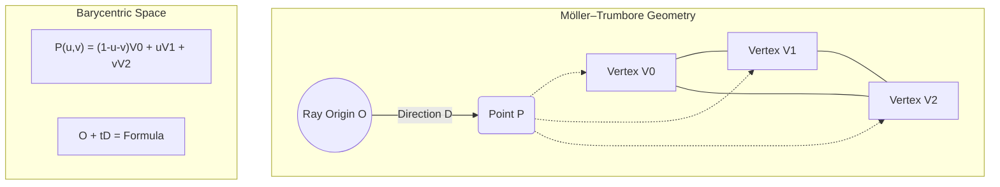

# Geometry & Intersection Logic

The performance of a path tracer is ultimately bound by how quickly it can determine where a ray hits a surface. Skewer's `geometry/` module is designed around **Data-Oriented Design (DOD)** principles, prioritizing cache efficiency and cross-platform flexibility over traditional object-oriented hierarchies.

## Architectural Principles

### No Virtual Functions
A key design decision in Skewer is the removal of polymorphism (virtual functions) in the intersection hot-path (`skewer/src/geometry/`).

#### Why Avoid Virtuals?

1.  **Cache Efficiency**: Polymorphic objects (e.g., a `virtual bool Intersect()` method) require a vtable pointer in every instance. This increases the object size and forces a "pointer-chase" to find the function logic, often causing cache misses.
2.  **Branch Prediction**: Indirect calls through vtables are difficult for CPU branch predictors to optimize, leading to pipeline stalls.
3.  **GPU Compatibility**: Modern GPUs (CUDA/OptiX/Vulkan) do not support standard C++ virtual function tables effectively. By using flat data structures and standalone intersection functions (e.g., `IntersectTriangle`), Skewer's core logic can be ported to GPU kernels with minimal refactoring.
4.  **Inlining**: Standalone functions can be fully inlined by the compiler, allowing for aggressive cross-functional optimizations that are impossible with virtual calls.

### Alignment & Memory Layout
All geometry structs use `alignas(16)` or `alignas(32)` where appropriate. This ensures that structs like `Triangle` or `BoundBox` never straddle a cache-line boundary, maximizing the effective bandwidth of the CPU's L1 cache.

### Precision & Self-Intersection
A common artifact in ray tracing is "Shadow Acne," caused by a ray intersecting its own origin due to floating-point imprecision.

#### Epsilon Management
Skewer handles this via `RenderConstants::kRayOffsetEpsilon` ($1 \cdot 10^{-3}$).

- **Offsetting**: When spawning a secondary ray (reflection, refraction, or shadow), the origin is pushed along the shading normal: $P' = P + (n \cdot \epsilon)$.
- This value was chosen as a "best-of-both-worlds" for scenes ranging from 1.0 to 1000.0 units in size.

---

## Directory Reference

The following sections detail the implementations within the `skewer/src/geometry/` directory.

### Bounding Boxes

The `BoundBox` class implements the **Slab Method**, which checks the overlap of three 1D intervals (the "slabs" between the box's parallel faces). This is essential for traversing the BVH and TLAS quickly.

<figure align="center">
  <svg width="400" height="220" viewBox="0 0 400 220" xmlns="http://www.w3.org/2000/svg">
    <rect x="120" y="60" width="160" height="100" fill="none" stroke="#666" stroke-width="2" stroke-dasharray="4"/>
    <line x1="40" y1="195" x2="360" y2="35" stroke="#ff5252" stroke-width="2" />
    <circle cx="120" cy="155" r="4" fill="#ff5252" />
    <circle cx="280" cy="75" r="4" fill="#ff5252" />
    <text x="130" y="175" fill="currentColor" font-size="12">t_min</text>
    <text x="290" y="95" fill="currentColor" font-size="12">t_max</text>
    <text x="165" y="105" fill="#888" font-size="14">AABB</text>
    <path d="M 40 210 L 360 210" stroke="currentColor" stroke-width="1" fill="none" />
    <polygon points="360,210 355,207 355,213" fill="currentColor" />
    <text x="370" y="215" fill="currentColor" font-size="12">t</text>
  </svg>
  <figcaption>Figure 1: Ray-AABB intersection via interval overlap.</figcaption>
</figure>

#### Traversal Optimizations

- **Pre-computed Inverses**: The `Ray` struct caches the `1.0 / direction` for all axes. This transforms the 6 divisions required by the Slab Method into 6 fast multiplications.
- **IEEE 754 Robustness**: By using pre-computed inverses, the algorithm naturally handles rays parallel to axes ($1.0 / 0.0 = \infty$), avoiding complex branching or "if-not-zero" checks in the inner BVH loop.
- **Zero-Thickness Fix**: `PadToMinimums()` ensures that flat axis-aligned geometry (like a single quad) has a non-zero volume in the BVH, preventing numerical misses.

### Mesh Data Structures

While many engines use an index-buffer approach to save memory during rendering, Skewer uses **Pre-baked Flat Triangles** for its traversal structures.

#### The "Baking" Strategy
When a `Mesh` is loaded and added to the scene, Skewer immediately pre-calculates and stores the following in the `Triangle` struct:

- **Edges**: $e_1 = p_1 - p_0$ and $e_2 = p_2 - p_0$.
- **Normals**: Per-vertex normals are pre-normalized.
- **UVs**: Explicitly stored for each vertex.

By storing the edges $e_1$ and $e_2$ directly, we save **two vector subtractions** per intersection test. In a scene with millions of triangles and hundreds of bounces, this saves billions of CPU instructions. As an offline renderer running on high-memory Cloud Batch instances, we deliberately trade RAM (larger triangle structs) for a significant reduction in render time.

### Ray-Triangle Intersection

Skewer implements the **Möller–Trumbore** algorithm, which solves for the intersection using barycentric coordinates ($u, v$) without needing to pre-calculate the plane equation.

### Spherical Primitives

- **`Sphere`**: A lightweight struct containing a center, radius, and material bindings. Spheres are treated as analytical mathematical primitives rather than tessellated meshes.
- **`AnimatedSphere`**: For moving objects, Skewer uses **Temporal Evaluation** rather than geometry deformation. The `AnimatedSphere` evaluates a TRS chain at `ray.time()` using **Slerp** for rotations and Cubic Bezier easing for translation/scale. This allows Skewer to render perfect motion blur without the "steppy" artifacts of multi-segment linear interpolation.

### Ray-Sphere Intersection

Intersections for analytical spheres are found by solving the quadratic equation:

$$
t^2(d \cdot d) + 2t(d \cdot (o - c)) + (o - c) \cdot (o - c) - r^2 = 0
$$

where $o$ is the ray origin, $d$ is the direction, $c$ is the sphere center, and $r$ is the radius.

- **Performance**: Solving the quadratic is significantly faster and more accurate than intersecting a high-resolution tessellated sphere.
- **Differential Geometry**: Skewer analytically calculates the surface tangents ($dp/du, dp/dv$). This is critical for correct normal mapping at the poles, where standard spherical UV mapping becomes degenerate.
