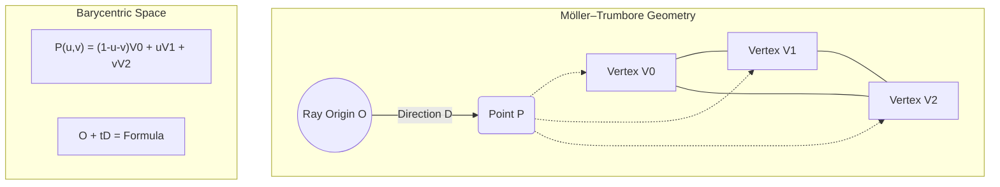

# Geometry & Intersection Logic

The performance of a path tracer is ultimately bound by how quickly it can determine where a ray hits a surface. Skewer's geometry system is designed around **Data-Oriented Design (DOD)** principles, prioritizing cache efficiency and cross-platform flexibility over traditional object-oriented hierarchies.

## Architectural Principles: No Virtual Functions

A key design decision in Skewer is the **complete absence of polymorphism** (virtual functions) in the intersection hot-path (`skewer/src/geometry/`).

### Why Avoid Virtuals?
1.  **Cache Efficiency**: Polymorphic objects (e.g., a `virtual bool Intersect()` method) require a vtable pointer in every instance. This increases the object size and forces a "pointer-chase" to find the function logic, often causing cache misses.
2.  **Branch Prediction**: Indirect calls through vtables are difficult for CPU branch predictors to optimize, leading to pipeline stalls.
3.  **GPU Compatibility**: Modern GPUs (CUDA/OptiX/Vulkan) do not support standard C++ virtual function tables effectively. By using flat structures and standalone functions (e.g., `IntersectTriangle`), Skewer's core logic can be ported to GPU kernels with minimal refactoring.
4.  **Inlining**: Standalone functions can be fully inlined by the compiler, allowing for aggressive cross-functional optimizations that are impossible with virtual calls.

## Optimized Ray-Triangle Intersection

Skewer implements the **Möller–Trumbore** algorithm (`skewer/src/geometry/intersect_triangle.h`), which solves for the intersection using barycentric coordinates ($u, v$) without needing to pre-calculate the plane equation.

This is the core primitive intersection for all 3D meshes. The Watertight Ray/Triangle Intersection algorithm is being considered for future implementation.

## Ray-Sphere Intersection

The intersection algorithm remains geometric in nature `skewer/src/geometry/intersect_sphere.h`. Intersections are found by solving the quadratic equation:

$$
t^2(d \cdot d) + 2t(d \cdot (o - c)) + (o - c) \cdot (o - c) - r^2 = 0
$$

where $o$ is the ray origin, $d$ is the direction, $c$ is the sphere center, and $r$ is the radius.

### Pre-baked "Flat" Triangles
Instead of the common approach of storing vertex/index buffers and looking up data at runtime, Skewer "bakes" meshes into an array of `Triangle` structs during the `Build()` phase.

- **Pre-computed Edges**: We store $e_1 = p_1 - p_0$ and $e_2 = p_2 - p_0$. This saves two vector subtractions per intersection test.
- **Normal & UV Baking**: Shading normals ($n_0, n_1, n_2$) and texture coordinates are stored directly in the struct, ensuring that all data required for shading is pulled into the cache simultaneously with the geometry.
- **Design Rationale**: As an offline renderer running on high-memory cloud instances, we trade memory (RAM) for raw throughput. Billions of saved instructions across a render result in significant cost savings on GCP.

## Ray-AABB Intersection (The Slab Method)

The `BoundBox` class (`skewer/src/geometry/boundbox.h`) implements the **Slab Method**, testing the ray against 3 pairs of parallel planes.

### Traversal Optimizations
- **Pre-computed Inverses**: The `Ray` struct caches the `1.0 / direction` for all axes. This transforms the 6 divisions required by the Slab Method into 6 fast multiplications.
- **IEEE 754 Robustness**: By using pre-computed inverses, the algorithm naturally handles rays parallel to axes ($1.0 / 0.0 = \infty$), avoiding complex branching or "if-not-zero" checks in the inner BVH loop.
- **Zero-Thickness Fix**: `PadToMinimums()` ensures that flat axis-aligned geometry (like a single quad) has a non-zero volume in the BVH, preventing numerical misses.

### 2.3 Ray-AABB (Slab Method)
Bounding box intersections use the "Slab Method," which checks the overlap of three 1D intervals (the "slabs" between the box's parallel faces).

<figure align="center">
  <svg width="400" height="220" viewBox="0 0 400 220" xmlns="http://www.w3.org/2000/svg">
    <rect x="120" y="60" width="160" height="100" fill="none" stroke="#666" stroke-width="2" stroke-dasharray="4"/>
    <line x1="40" y1="195" x2="360" y2="35" stroke="#ff5252" stroke-width="2" />
    <circle cx="120" cy="155" r="4" fill="#ff5252" />
    <circle cx="280" cy="75" r="4" fill="#ff5252" />
    <text x="130" y="175" fill="currentColor" font-size="12">t_min</text>
    <text x="290" y="95" fill="currentColor" font-size="12">t_max</text>
    <text x="165" y="105" fill="#888" font-size="14">AABB</text>
    <path d="M 40 210 L 360 210" stroke="currentColor" stroke-width="1" fill="none" />
    <polygon points="360,210 355,207 355,213" fill="currentColor" />
    <text x="370" y="215" fill="currentColor" font-size="12">t</text>
  </svg>
  <figcaption>Figure 1: Ray-AABB intersection via interval overlap.</figcaption>
</figure>

*   **Application:** Essential for traversing the **BVH (Bounding Volume Hierarchy)** and **TLAS** quickly.
*   **Implementation:** `skewer/src/geometry/boundbox.h

## Primitive Types

### 1. Analytical Spheres
Spheres are treated as mathematical primitives (`sphere.h`). 
- **Precision**: Intersection is solved via the quadratic formula, ensuring perfect curvature regardless of zoom level.
- **Differential Geometry**: Skewer analytically calculates the surface tangents ($dp/du, dp/dv$). This is critical for correct normal mapping at the poles, where standard spherical UV mapping becomes degenerate.

### 2. Temporal Evaluation (Animated Geometry)
Animation is handled through **Temporal Sampling** rather than geometry deformation.
- **`AnimatedSphere`**: Evaluates a TRS chain at `ray.time()` using **Slerp** for rotations and Cubic Bezier easing for translation/scale.
- **Motion Bounds**: During the scene build, we calculate the union of the bounding boxes at `shutter_open` and `shutter_close`, ensuring that the acceleration structures are valid for the entire motion-blurred interval.

## Alignment & Memory Layout
All geometry structs use `alignas(16)` or `alignas(32)` where appropriate. This ensures that a `Triangle` or `BVHNode` never straddles a cache-line boundary, maximizing the effective bandwidth of the CPU's L1 cache.
