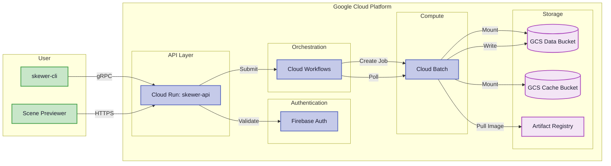
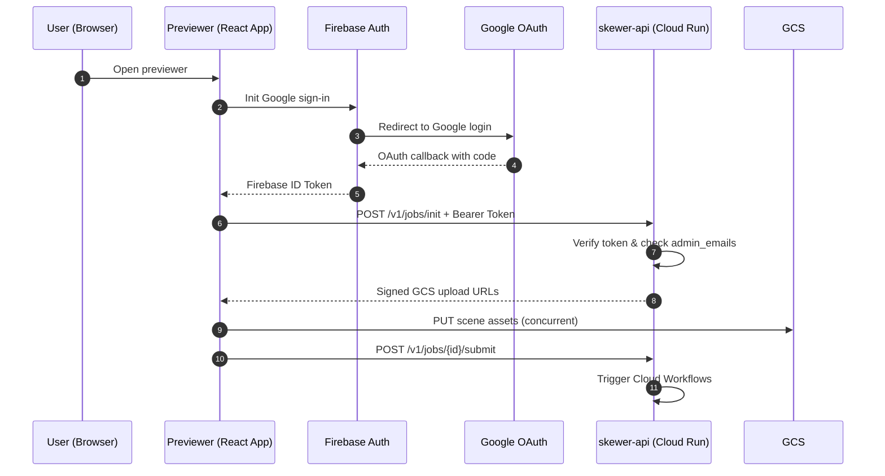
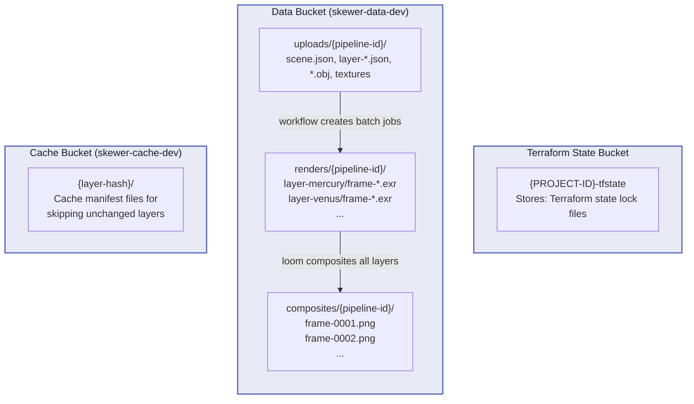

# GCP Deployment Guide

This guide walks you through setting up a complete Skewer serverless render farm on Google Cloud Platform, from creating a new project to rendering your first scene from the web previewer.

## Architecture Overview

Before setting up, here's how the render pipeline works:



The pipeline orchestrates parallel layer rendering via Cloud Batch, writes frames to GCS, then composites all layers into final PNG images. The previewer uploads scene assets, triggers the pipeline, and polls for completion.

---

## Prerequisites

Install the following tools before beginning:

| Tool                                                                     | Minimum Version | Install Guide                                                                  |
| ------------------------------------------------------------------------ | --------------- | ------------------------------------------------------------------------------ |
| [Google Cloud SDK (`gcloud`)](https://cloud.google.com/sdk/docs/install) | latest          | [Install guide](https://cloud.google.com/sdk/docs/install)                     |
| [Terraform](https://developer.hashicorp.com/terraform/install)           | >= 1.6          | [Install guide](https://developer.hashicorp.com/terraform/install)             |
| [Node.js](https://nodejs.org/en)                                         | >= 26           | [Install guide](https://nodejs.org/en/download)                                |
| [pnpm](https://pnpm.io)                                                  | >=10            | [Install guide](https://pnpm.io/installation)                                  |
| [Git](https://git-scm.com/)                                              | latest          | [Install guide](https://git-scm.com/book/en/v2/Getting-Started-Installing-Git) |

---

## Step 1: Create a Google Cloud Project

1. Open the [GCP Console](https://console.cloud.google.com/)
2. Click the project dropdown at the top of the page → **New Project**
3. Enter a project name (e.g., `skewer-render-farm`)
4. Note the **Project ID** — you'll need it throughout this guide
5. Click **Create**

!!! note "Authentication"
    After installing `gcloud`, authenticate and set your project:
    ```bash
    gcloud auth login
    gcloud config set project YOUR_PROJECT_ID
    ```

!!! important "Billing Required"
    Ensure billing is enabled on your project. Go to [Billing](https://console.cloud.google.com/billing) and link a billing account. Education accounts (Google Cloud for Education) include credits that cover typical rendering workloads.

---

## Step 2: Set Up Firebase Authentication

The scene previewer uses Firebase Authentication for Google sign-in. This lets users authenticate with their Google account and obtain an ID token that the Skewer API verifies.

### 2.1 Create a Firebase Project

1. Open the [Firebase Console](https://console.firebase.google.com/)
2. Click **Add project**
3. Select your **existing GCP project** from the dropdown (the one created in [Step 1](#step-1-create-a-google-cloud-project))
4. Follow the prompts to complete setup (you can leave Analytics disabled)

See [Add Firebase to your project](https://firebase.google.com/docs/projects/learn-more#add-resources-existing-gcp) for details.

### 2.2 Google Sign-In Provider
You do **not** need to manually add or enable the **Google** sign-in provider in the Firebase Console before running `terraform apply`. The Terraform configuration manages the Google Identity Platform provider automatically, but it needs your OAuth 2.0 credentials to do so.

Instead, follow these steps to provide your credentials to Terraform:

1. Complete [**Step 4**](#step-4-create-an-oauth-20-client-in-gcp-console) to create an OAuth 2.0 client in the GCP Console
   and obtain a **Client ID** and **Client Secret**.
2. Complete [**Step 5**](#step-5-configure-terraformtfvars) to fill in the `google_idp_client_id` and
   `google_idp_client_secret` fields in `terraform.tfvars`.
3. When you run `terraform apply` ([Step 7](#step-7-deploy-infrastructure-with-terraform)), Terraform will automatically
   create and enable the Google sign-in provider using those credentials.

!!! warning "Manual Conflict"
    Enabling Google sign-in manually in the Firebase Console **before**
    `terraform apply` will cause Terraform to fail with a resource-already-exists
    error. If you've already done this, see the import instructions in
    [Step 7.3](#73-note-the-api-url) and how to fix.

See [Google Sign-In with Firebase](https://firebase.google.com/docs/auth/web/google-signin) for more information.

### 2.3 Register a Web Application

1. In the Firebase Console, go to **Project settings** (gear icon) → **General** tab
2. Scroll to **Your apps** → click the **Web** icon (`</>`)
3. Enter an app nickname (e.g., `skewer-preview`)
4. Click **Register app**
5. Copy the following values from the Firebase SDK config:
   - **API Key** → use as `VITE_FIREBASE_API_KEY`
   - **Auth Domain** → use as `VITE_FIREBASE_AUTH_DOMAIN` (format: `your-project-id.firebaseapp.com`)
6. Click **Continue to console**

!!! danger "Account Conflict"
    Use the **same Google email** for both your Firebase project and GCP Console. Mixing accounts can cause permission conflicts when Terraform provisions Identity Platform resources.

---

## Step 3: Configure Environment Variables

1. Clone the repository and change to the project root:
   ```bash
   git clone https://github.com/skewer-project/skewer.git
   cd skewer
   ```

2. Copy the example file:
   ```bash
   cp apps/scene-previewer/.env.example apps/scene-previewer/.env
   ```

3. Open `apps/scene-previewer/.env` and fill in the values from [Step 2](#step-2-set-up-firebase-authentication) and [Step 7](#step-7-deploy-infrastructure-with-terraform):

   ```
   VITE_API_URL=https://skewer-api-XXXXX.REGION.run.app         # filled in after [Step 7](#step-7-deploy-infrastructure-with-terraform)
   VITE_FIREBASE_API_KEY=your_api_key                           # from [Step 2.3](#23-register-a-web-application)
   VITE_FIREBASE_AUTH_DOMAIN=your-project-id.firebaseapp.com    # from [Step 2.3](#23-register-a-web-application)
   ```

!!! note "API URL"
    `VITE_API_URL` will be set after Terraform finishes deploying — the Cloud Run API URL is printed in the Terraform output as `api_url`.

---  

## Step 4: Create an OAuth 2.0 Client in GCP Console

Firebase needs an OAuth 2.0 Client ID to authenticate users via Google. This links your Firebase project to your GCP project.

1. Open [APIs & Services → Credentials](https://console.cloud.google.com/apis/credentials) in the GCP Console
2. Click **+ Create Credentials** → **OAuth client ID**
3. If prompted, configure the OAuth consent screen:
   - **User Type**:
     - Choose **Internal** only if your GCP project belongs to a Google Workspace or Cloud Identity organization.
     - Choose **External** if you're using a personal Gmail account or an individual project, then add yourself as a test user if Google prompts you to do so.
   - App name: `Skewer Previewer` (or any name)
   - User support email: your email
   - Developer contact email: your email
   - Click **Save and Continue** through the remaining screens
4. For the OAuth client:
   - Application type: **Web application**
   - Name: `web client` (or any name)
   - **Authorized JavaScript origins** — add these three URIs:
     ```
     http://localhost
     http://localhost:5173
     https://YOUR_PROJECT_ID.firebaseapp.com
     ```
   - **Authorized redirect URIs** — add this URI:
     ```
     https://YOUR_PROJECT_ID.firebaseapp.com/__/auth/handler
     ```
   - Click **Create**

5. After creation, copy the **Client ID** and **Client Secret** — you'll need them in [Step 5](#step-5-configure-terraformtfvars).

!!! danger "Project ID Required"
    Replace `YOUR_PROJECT_ID` with your **actual GCP project ID** (not the project number or Firebase app name). These can differ. You can find your project ID in the [GCP Console project selector](https://console.cloud.google.com/projectselector2/home/dashboard).

See [Create an OAuth 2.0 Client ID](https://developers.google.com/identity/protocols/oauth2#1.-obtain-oauth-2.0-credentials-from-the-dynamicdata.setvar.console_name-.) for full documentation.

### How Authentication Works



When a user signs in, Firebase handles the Google OAuth flow and returns an ID token. The previewer sends this token with every API request. The `skewer-api` service verifies the token and checks that the user's email is in `admin_emails` before allowing any actions.

---

## Step 5: Configure `terraform.tfvars`

Terraform variables control your deployment configuration.

1. Copy the sample file:
   ```bash
   cp deployments/terraform/terraform.tfvars.sample deployments/terraform/terraform.tfvars
   ```

2. Open `deployments/terraform/terraform.tfvars` and fill in the required fields (marked with `# CHANGE`):

   ```hcl
   project_id  = "YOUR_GCP_PROJECT_ID"       # Your GCP project ID
   region      = "us-west2"                  # Your preferred GCP region
   
   admin_emails = ["your-email@gmail.com"]   # Emails authorized to use the previewer
   
   google_idp_client_id     = "YOUR_CLIENT_ID"      # From [Step 4](#step-4-create-an-oauth-20-client-in-gcp-console)
   google_idp_client_secret = "YOUR_CLIENT_SECRET"  # From [Step 4](#step-4-create-an-oauth-20-client-in-gcp-console)
   ```

   Other fields can be left at their defaults. They control worker machine types, CPU/memory allocation, retry counts, and data retention policies.

!!! warning "Admin Emails Required"
    The `admin_emails` field controls who can submit renders from the previewer. **Include your Google account email**, or you will be denied access when trying to render. Add additional emails for team members who need render access.

---

## Step 6: Create a Terraform State Bucket

Terraform stores its state in a GCS bucket. This must be created manually before running `terraform init`.

1. Open [Cloud Storage → Buckets](https://console.cloud.google.com/storage/browser) in the GCP Console
2. Click **+ Create**
3. Name the bucket: `YOUR_PROJECT_ID-tfstate` (e.g., `skewer-render-farm-tfstate`)
4. Leave all other settings at default
5. Click **Create**

!!! danger "Globally Unique Bucket Name"
    GCS bucket names must be **globally unique** across all GCP users. Using `YOUR_PROJECT_ID-tfstate` is recommended since project IDs are unique.

See [Bucket naming requirements](https://cloud.google.com/storage/docs/naming-buckets) for details.

---

## Step 7: Deploy Infrastructure with Terraform

### 7.1 Update the Backend Configuration

You will need to update the `backend` with your bucket configuration. Start by copying the backend example and edit the bucket name.

```sh
cp deployments/terraform/backend.example.hcl deployments/terraform/backend.hcl
```

Use a bucket tied to your project, for example:

```hcl
bucket = "YOUR_PROJECT_ID-tfstate"
prefix = "skewer"
```

!!! note "Prefix"
    The prefix will prepend all principals across the workflow (IAM names, VPCs, bucket items, etc.)

The bucket must exist before Terraform can initialize the backend. Then run:

```sh
terraform init -backend-config=backend.hcl
```

If this checkout was already initialized against a different backend, use:

```sh
terraform init -reconfigure -backend-config=backend.hcl
```

If you intentionally want to move existing state into your new bucket, use
`-migrate-state` instead of `-reconfigure` and review Terraform's migration
prompt carefully.

!!! note "Contributing"
    Keep `backend.hcl` and `terraform.tfvars` uncommitted. Commit only the shared
    Terraform modules and example files.

See the [Terraform GCS backend documentation](https://developer.hashicorp.com/terraform/language/settings/backends/gcs) for more details.

### 7.2 Initialize and Apply

```bash
cd deployments/terraform
terraform init
terraform apply
```

This will provision:

   - VPC network and subnets
   - Cloud Run services (`skewer-api`, `skewer-coordinator`)
   - Cloud Workflows pipeline (`skewer-render-pipeline`)
   - Artifact Registry repository
   - GCS buckets for data and caching
   - IAM service accounts and roles
   - Identity Platform configuration

### 7.3 Note the API URL

After `terraform apply` completes, look for this line in the output:

```
api_url = "https://skewer-api-XXXXX.REGION.run.app"
```

**Copy this URL** — you'll need it for `.env` in [Step 3](#step-3-configure-environment-variables).

!!! important "Identity Platform Already Enabled"
    If `terraform apply` fails with:
    ```
    Error: Error creating Config: googleapi: Error 400: INVALID_PROJECT_ID : Identity Platform has already been enabled for this project.
    ```
    This means Identity Platform was enabled manually (via Firebase Console) before Terraform ran. Fix it by importing the existing resource:
    ```bash
    terraform import 'google_identity_platform_config.default' 'YOUR_PROJECT_ID'
    terraform apply
    ```
    See [Terraform Import](https://developer.hashicorp.com/terraform/cli/import) for details.

!!! important "Google Identity Provider Not Created"
    If you see this error after `terraform apply`:
    ```
    Firebase: Error (auth/operation-not-allowed)
    ```
    The Google identity provider was not created. This happens if `google_idp_client_id` and `google_idp_client_secret` were not set in `terraform.tfvars`. Fix it by:

    1. Adding the correct values to `terraform.tfvars`
    2. Running `terraform apply` again

### GCS Bucket Layout

After deployment, your project will have several GCS buckets. Here's how they're used:



- **Data Bucket**: Scene uploads, rendered layer frames (EXR), and final composited PNGs. Lifecycle rules auto-delete old renders after 30 days.
- **Cache Bucket**: Layer cache manifests. If a layer's content hasn't changed, the workflow skips rendering and reuses cached output. Lifecycle rules auto-delete after 90 days.
- **TFState Bucket**: Terraform remote state and locking. Created manually in [Step 6](#step-6-create-a-terraform-state-bucket).

See [GCS lifecycle management](https://cloud.google.com/storage/docs/lifecycle) for details on automatic cleanup.

---

## Step 8: Build and Push Docker Images

Since this is a fresh project and no images exist for it yet, you can build them manually from your local checkout. This uses `cloudbuild_from_local.yaml`, which skips the LFS fetch step (`cloudbuild.yaml` is reserved for the automated trigger that does a fresh git checkout and needs it).

Assuming you are still in the `deployments/terraform` directory, run:

```bash
gcloud auth login
gcloud config set project YOUR_PROJECT_ID

REGION="YOUR_TERRAFORM_REGION"
SERVICE_ACCOUNT=$(terraform output -raw cloudbuild_service_account_email)

gcloud builds submit \
  --config ../cloudbuild_from_local.yaml \
  --service-account "projects/YOUR_PROJECT_ID/serviceAccounts/${SERVICE_ACCOUNT}" \
  --substitutions _REGION="$REGION",_AR_BASE="$REGION-docker.pkg.dev/YOUR_PROJECT_ID/skewer"
```

!!! note "git LFS"
    The C++ skewer worker build needs one LFS-tracked file: `skewer/external/srgb_spec_data.h`. The rest of the LFS files (test assets, golden images, sample volumes) are only needed for development and testing — not for deploying your own render farm. Navigate to the project root and pull just what you need:

    ```bash
    git lfs pull --include="skewer/external/srgb_spec_data.h"
    ```

---

## Step 9: Render Your First Scene

### From the Previewer

Navigate to the project root. From there go to `apps/scene-previewer` and run the previewer locally using pnpm:

```bash
cd apps/scene-previewer
pnpm install
pnpm run dev
```

1. Open http://localhost:5173
2. Sign in with Google
3. Click **Open Existing Scene**
4. Select a scene folder containing `scene.json` and layer files

    !!! note "Scene Format"
        See the [Scene Format Guide](../reference/scene-format.md) for the complete specification of scene files, including the sample template at `apps/scene-previewer/public/templates/scene.json`.

5. Click **Render** to submit the pipeline

!!! tip "Creating a New Scene"
    The easiest way to start is to copy the sample scene from `apps/scene-previewer/public/templates/scene.json` (and its accompanying layer files from the same directory). Modify the camera, materials, and geometry to match your needs, then upload the folder via the previewer.

### Monitor Progress

After submitting, click the cloud icon in the top-right corner of the previewer to open the job tracker. The tracker shows each layer's render status as the pipeline progresses.

<video controls width="100%">
  <source src="../images/gcp-previewer-overview.mp4" type="video/mp4">
  Your browser does not support the video tag.
</video>
*Navigating the scene previewer with a loaded scene. Layers, objects, and materials appear in the sidebar.*

The cloud workflow orchestrates the process:

1. All layers render in parallel on separate Cloud Batch VMs
2. After all layers complete, a Loom compositing job merges them
3. The final composite is written to the output directory

Refresh the tracker periodically to see updated status. If a layer fails, the tracker shows the error — check the [troubleshooting section](#troubleshooting-common-issues) below.

### View the Result

Once compositing finishes, the rendered output is available:

**Locally (on your machine):** Open the scene folder you uploaded. The pipeline writes a `composites/` directory containing the final PNG, flat EXR, and merged deep EXR.

<video controls width="100%">
  <source src="../images/gcp-render-complete.mp4" type="video/mp4">
  Your browser does not support the video tag.
</video>
*Opening the job tracker showing completed renders, then downloading the final composited frame.*

**In GCS:** The output is also stored in the data bucket at `gs://<data-bucket>/jobs/<job-id>/composites/`. Use `gsutil` to download:

```bash
gsutil cp gs://<data-bucket>/jobs/<job-id>/composites/frame-0001.png .
```

If the result looks wrong, see the compositing common issues in the [Loom developer docs](../developer/loom/index.md#common-issues) for troubleshooting mismatched resolutions or NaN propagation.

---

## Troubleshooting & Common Issues

### Layer ID Length Limit

Layer IDs (derived from layer JSON filenames, e.g., `mercury.json` → `mercury`) must be **≤ 16 characters**. Longer names cause GCP Batch job ID creation to fail with `INVALID_ARGUMENT`.

| Example                    | Layer ID              | Length | Status |
| -------------------------- | --------------------- | ------ | ------ |
| `mercury.json`             | `mercury`             | 7      | OK     |
| `asteroids.json`           | `asteroids`           | 9      | OK     |
| `layer-asteroid-belt.json` | `layer-asteroid-belt` | 20     | FAIL   |

### No Underscores in Filenames

GCP Batch job IDs only allow **lowercase letters, numbers, and hyphens** (`^[a-z]([a-z0-9-]{0,61}[a-z0-9])?$`). Underscores in layer, context, or scene filenames are automatically converted to hyphens by the workflow, but it's best to avoid them entirely.

### SSD Quota and VM Concurrency

GCP projects have a default **300 GB SSD limit** in most regions. Each render VM uses a 30 GB `pd-balanced` boot disk, so you can run a maximum of **10 concurrent VMs**. If quota is exhausted, additional jobs will queue until VMs complete and disks are released.

To check your current quota:
```bash
gcloud compute project-info describe --format="json(quotas)" | python3 -c "
import json, sys
data = json.load(sys.stdin)
for q in data.get('quotas', []):
    if 'SSD' in q.get('metric', ''):
        print(f\"SSD: {q['usage']}/{q['limit']} GB\")
"
```

To request a quota increase, visit [IAM & Admin → Quotas](https://console.cloud.google.com/iam-admin/quotas) and search for `SSD_TOTAL_GB`. See [Viewing and managing quotas](https://cloud.google.com/docs/quota/view-manage) for details.

### Spot VM Provisioning Delays

Skewer render workers use **SPOT instances** by default (`provisioningModel: "SPOT"`) for up to 80% cost savings. Initial pipeline runs may experience delays as GCP provisions spot VMs, especially during high-demand periods. The workflow handles this gracefully via polling.

### Expected Render Times

- Each layer takes approximately **20–40 minutes** to render (depends on scene complexity and machine type)
- The composite step runs automatically after all layers finish
- Total pipeline time ≈ (number of layers × 20–40 min) + composite time

### Authentication Errors

#### `Firebase: Error (auth/operation-not-allowed)`

The Google identity provider is not properly configured. Fix:

1. Verify `google_idp_client_id` and `google_idp_client_secret` are set correctly in `terraform.tfvars`
2. Run `terraform apply` again
3. Alternatively, enable Google sign-in manually in [Firebase Console → Authentication → Sign-in method](https://console.firebase.google.com/project/_/authentication/providers)

#### `The request was not authenticated` (401)

The previewer isn't sending a valid Firebase ID token. Fix:

1. Sign out and sign back in to refresh the auth token
2. Verify `VITE_FIREBASE_API_KEY` and `VITE_FIREBASE_AUTH_DOMAIN` are correct in `.env`
3. Check browser DevTools Console for auth errors

### CORS Errors

If the previewer reports CORS-blocked requests, verify that `previewer_cors_origins` in `terraform.tfvars` includes your dev server URL:

```hcl
previewer_cors_origins = ["http://localhost:5173"]
```

Then run `terraform apply` to update the Cloud Run service.

### Workflow Timeout Errors

If a workflow execution fails with a timeout error after ~30 minutes, this was caused by an older workflow definition that blocked on batch job creation. The current workflow uses `skip_polling: true` on batch job creation, so it returns immediately and polls asynchronously. If you still encounter this, re-run `terraform apply` to ensure the latest workflow is deployed.

---

## See Also

- [Scene Format](../reference/scene-format.md) - Complete guide to scene.json, layer files, materials, and animation
- [Rendering Tips](../reference/rendering-tips.md) - Best practices for quality and performance
- [Animation](../reference/animation.md) - Keyframe animation and motion blur
- [Architecture Overview](../developer/overview.md)
- [Coordinator Architecture](../developer/api/coordinator.md)
- [Skewer Renderer](../developer/skewer/architecture.md) — Cloud Batch execution model
- [Loom Compositor](../developer/loom/index.md) — Compositing pipeline
- [CLI Reference](../reference/cli.md) — Command-line options
- [Mathematical Foundations](../reference/math.md) — Rendering math and physics
- [Local Deployment](local.md)
