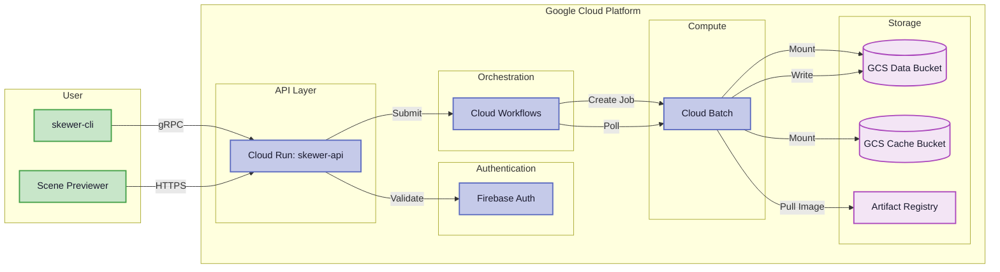

# GCP Deployment Guide

This guide walks you through setting up a complete Skewer serverless render farm on Google Cloud Platform, from creating a new project to rendering your first scene from the web previewer.

## Architecture Overview

Before setting up, here's how the render pipeline works:



## Prerequisites

Before you begin, you'll need:

1. A **Google Cloud Project** with billing enabled ([free credits available](https://cloud.google.com/free))
2. A **GitHub account** (for the initial repo clone)
3. The following tools installed locally:
   - [Google Cloud SDK](https://cloud.google.com/sdk/docs/install) (`gcloud`)
   - [Terraform](https://developer.hashicorp.com/terraform/downloads) (v1.5+)
   - [Git](https://git-scm.com/downloads)

## 1. Clone the Repository

```bash
git clone https://github.com/skewer-project/skewer
cd skewer
```

## 2. Enable Required APIs

Enable the services used by Skewer:

```bash
gcloud services enable \
    cloudresourcemanager.googleapis.com \
    run.googleapis.com \
    workflows.googleapis.com \
    batch.googleapis.com \
    storage.googleapis.com \
    artifactregistry.googleapis.com \
    firebase.googleapis.com \
    compute.googleapis.com \
    iamcredentials.googleapis.com \
    cloudbuild.googleapis.com
```

## 3. Create a Terraform Variable File

```bash
cd deployments/terraform
cp terraform.tfvars.example terraform.tfvars
```

Edit `terraform.tfvars` with your project details:

```hcl
# Required: Your GCP project ID
project_id = "skewer-xxxxx"

# Required: Billing account ID
billing_account = "XXXXXX-XXXXXX-XXXXXX"

# Required: Admin email addresses for the API
admin_emails = ["your.email@gmail.com"]

# Optional: Firebase Identity Platform config
firebase_project_id = "skewer-xxxxx"
google_idp_client_id = ""
google_idp_client_secret = ""

# Optional: Override defaults
region = "us-west1"
machine_type = "n2d-highcpu-8"
```

## 4. Apply Terraform

```bash
terraform init
terraform apply
```

This provisions:

- **Cloud Run** service for the API/Coordinator
- **Cloud Workflows** definition for the render pipeline
- **Cloud Batch** configuration for workers
- **GCS Buckets** for data and cache storage
- **Artifact Registry** repository for worker images
- **Firebase** project for authentication
- **IAM** roles and service accounts

The initial apply takes approximately **5–10 minutes**.

## 5. Build and Push Worker Images

```bash
# Build and push the Skewer renderer worker image
gcloud builds submit --config cloudbuild.yaml

# Verify the image was pushed
gcloud artifacts docker images list \
  --repository=us-west1-docker.pkg.dev/$PROJECT_ID/skewer-workers
```

## 6. Configure Firebase Authentication

1. Open the [Firebase Console](https://console.firebase.google.com/)
2. Select your project
3. Go to **Authentication → Sign-in method**
4. Enable **Google** as a sign-in provider
5. Copy the **Web client ID** and **Web client secret**
6. Update your `terraform.tfvars`:

```hcl
google_idp_client_id = "xxxxxxxxxxxx-xxxxxxxxxxxxxxxxxxxxxxxxxxxxxxxx.apps.googleusercontent.com"
google_idp_client_secret = "GOCSPX-xxxxxxxxxxxxxxxxxxxxx"
```

7. Re-apply Terraform:

```bash
terraform apply
```

## 7. Deploy the Previewer

Create a `.env` file in `apps/scene-previewer/`:

```bash
cd apps/scene-previewer

cat > .env << EOF
VITE_API_URL=https://skewer-api-xxxxx-uc.a.run.app
VITE_FIREBASE_API_KEY=AIzaSyxxxxxxxxxxxxxxxxxxxxxxxxxxxxxxxxxxx
VITE_FIREBASE_AUTH_DOMAIN=skewer-xxxxx.firebaseapp.com
VITE_FIREBASE_PROJECT_ID=skewer-xxxxx
EOF
```

Run the previewer locally:

```bash
bun install
bun run dev
```

## 8. Render Your First Scene

### From the Previewer

1. Open http://localhost:5173
2. Sign in with Google
3. Click **Open Existing Scene**
4. Select a scene folder containing `scene.json` and layer files

    !!! note "Scene Format"
        See the [Scene Format Guide](../reference/scene-format.md) for the complete specification of scene files, including the sample template at `apps/scene-previewer/public/templates/scene.json`.

5. Click **Render** to submit the pipeline

!!! tip "Creating a New Scene"
    The easiest way to start is to copy the sample scene from `apps/scene-previewer/public/templates/scene.json` (and its accompanying layer files from the same directory). Modify the camera, materials, and geometry to match your needs, then upload the folder via the previewer.

### Monitor Progress

After submitting, click the cloud icon in the top-right corner of the previewer to open the job tracker. The tracker shows each layer's render status as the pipeline progresses.

<video controls width="100%">
  <source src="../images/gcp-previewer-overview.mp4" type="video/mp4">
  Your browser does not support the video tag.
</video>
*Navigating the scene previewer with a loaded scene. Layers, objects, and materials appear in the sidebar.*

The cloud workflow orchestrates the process:
1. All layers render in parallel on separate Cloud Batch VMs
2. After all layers complete, a Loom compositing job merges them
3. The final composite is written to the output directory

Refresh the tracker periodically to see updated status. If a layer fails, the tracker shows the error — check the troubleshooting section below.

### View the Result

Once compositing finishes, the rendered output is available:

**Locally (on your machine):** Open the scene folder you uploaded. The pipeline writes a `composites/` directory containing the final PNG, flat EXR, and merged deep EXR.

<video controls width="100%">
  <source src="../images/gcp-render-complete.mp4" type="video/mp4">
  Your browser does not support the video tag.
</video>
*Opening the job tracker showing completed renders, then downloading the final composited frame.*

**In GCS:** The output is also stored in the data bucket at `gs://<data-bucket>/jobs/<job-id>/composites/`. Use `gsutil` to download:

```bash
gsutil cp gs://<data-bucket>/jobs/<job-id>/composites/frame-0001.png .
```

If the result looks wrong, see the compositing common issues in the [Loom developer docs](../developer/loom/index.md#common-issues) for troubleshooting mismatched resolutions or NaN propagation.

---

## Troubleshooting & Common Issues

### Layer ID Length Limit

Layer IDs (derived from layer JSON filenames, e.g., `mercury.json` → `mercury`) must be **≤ 16 characters**. Longer names cause GCP Batch job ID creation to fail with `INVALID_ARGUMENT`.

| Example                    | Layer ID              | Length | Status |
| -------------------------- | --------------------- | ------ | ------ |
| `mercury.json`             | `mercury`             | 7      | OK     |
| `asteroids.json`           | `asteroids`           | 9      | OK     |
| `layer-asteroid-belt.json` | `layer-asteroid-belt` | 20     | FAIL   |

### No Underscores in Filenames

GCP Batch job IDs only allow **lowercase letters, numbers, and hyphens** (`^[a-z]([a-z0-9-]{0,61}[a-z0-9])?$`). Underscores in layer, context, or scene filenames are automatically converted to hyphens by the workflow, but it's best to avoid them entirely.

### SSD Quota and VM Concurrency

GCP projects have a default **300 GB SSD limit** in most regions. Each render VM uses a 30 GB `pd-balanced` boot disk, so you can run a maximum of **10 concurrent VMs**. If quota is exhausted, additional jobs will queue until VMs complete and disks are released.

To check your current quota:
```bash
gcloud compute project-info describe --format="json(quotas)" | python3 -c "
import json, sys
data = json.load(sys.stdin)
for q in data.get('quotas', []):
    if 'SSD' in q.get('metric', ''):
        print(f\"SSD: {q['usage']}/{q['limit']} GB\")
"
```

To request a quota increase, visit [IAM & Admin → Quotas](https://console.cloud.google.com/iam-admin/quotas) and search for `SSD_TOTAL_GB`. See [Viewing and managing quotas](https://cloud.google.com/docs/quota/view-manage) for details.

### Spot VM Provisioning Delays

Skewer render workers use **SPOT instances** by default (`provisioningModel: "SPOT"`) for up to 80% cost savings. Initial pipeline runs may experience delays as GCP provisions spot VMs, especially during high-demand periods. The workflow handles this gracefully via polling.

### Expected Render Times

- Each layer takes approximately **20–40 minutes** to render (depends on scene complexity and machine type)
- The composite step runs automatically after all layers finish
- Total pipeline time ≈ (number of layers × 20–40 min) + composite time

### Authentication Errors

#### `Firebase: Error (auth/operation-not-allowed)`

The Google identity provider is not properly configured. Fix:
1. Verify `google_idp_client_id` and `google_idp_client_secret` are set correctly in `terraform.tfvars`
2. Run `terraform apply` again
3. Alternatively, enable Google sign-in manually in [Firebase Console → Authentication → Sign-in method](https://console.firebase.google.com/project/_/authentication/providers)

#### `The request was not authenticated` (401)

The previewer isn't sending a valid Firebase ID token. Fix:
1. Sign out and sign back in to refresh the auth token
2. Verify `VITE_FIREBASE_API_KEY` and `VITE_FIREBASE_AUTH_DOMAIN` are correct in `.env`
3. Check browser DevTools Console for auth errors

### CORS Errors

If the previewer reports CORS-blocked requests, verify that `previewer_cors_origins` in `terraform.tfvars` includes your dev server URL:

```hcl
previewer_cors_origins = ["http://localhost:5173"]
```

Then run `terraform apply` to update the Cloud Run service.

### Workflow Timeout Errors

If a workflow execution fails with a timeout error after ~30 minutes, this was caused by an older workflow definition that blocked on batch job creation. The current workflow uses `skip_polling: true` on batch job creation, so it returns immediately and polls asynchronously. If you still encounter this, re-run `terraform apply` to ensure the latest workflow is deployed.

---

## See Also

- [Scene Format](../reference/scene-format.md) - Complete guide to scene.json, layer files, materials, and animation
- [Rendering Tips](../reference/rendering-tips.md) - Best practices for quality and performance
- [Animation](../reference/animation.md) - Keyframe animation and motion blur
- [Architecture Overview](../developer/overview.md)
- [Coordinator Architecture](../developer/api/coordinator.md)
- [Skewer Renderer](../developer/skewer/architecture.md) — Cloud Batch execution model
- [Loom Compositor](../developer/loom/index.md) — Compositing pipeline
- [CLI Reference](../reference/cli.md) — Command-line options
- [Mathematical Foundations](../reference/math.md) — Rendering math and physics
- [Local Deployment](local.md)
