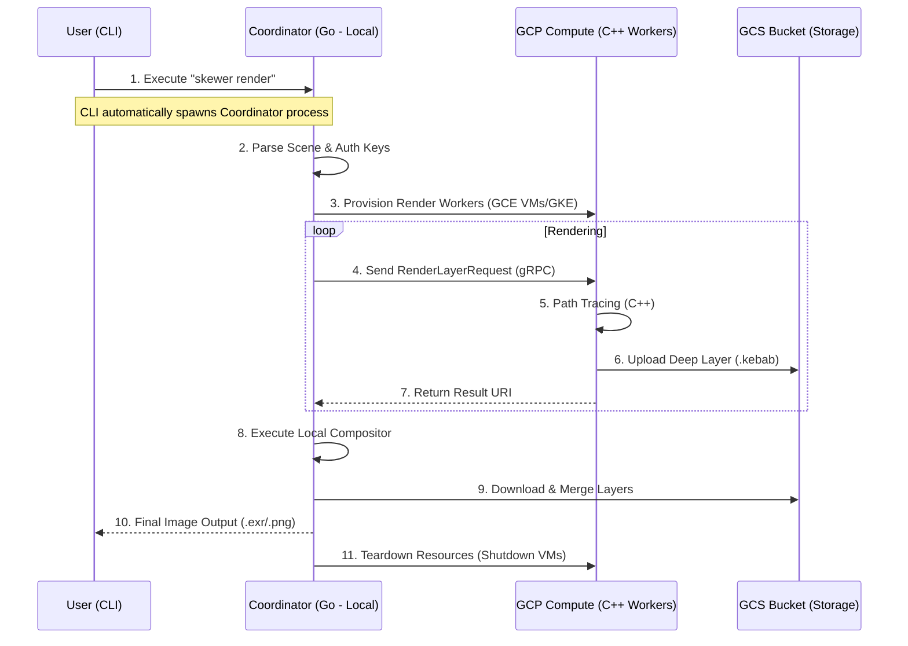

# Skewer Control Flow: Distributed Rendering

This document explains how the different services in Skewer interact when a user initiates a render job.

## 1. High-Level Flowchart

## 2. Component Responsibilities

### A. The CLI Entry Point (`apps/cli/`)
*   **Location:** User's Local machine.
*   **Role:** The user's interface. When run, it checks if a local Coordinator is active; if not, it spawns one as a background process.
*   **Lifecycle:** Stays alive as long as the user wants to monitor the render.

### B. The Coordinator (`apps/coordinator/`)
*   **Location:** User's Local machine.
*   **Role:** The "Orchestrator." 
    *   Reads the user's GCP Service Account key.
    *   Calls GCP APIs to spin up high-performance VMs.
    *   Slices the image into layers/tasks and distributes them via gRPC.
    *   Ensures workers are shut down after completion to save the user money.

### C. The Worker (`apps/worker/`)
*   **Location:** User's Google Cloud Project (Remote VMs).
*   **Role:** The "Computation Engine."
    *   Receives render tasks via gRPC.
    *   Renders high-quality path-traced layers.
    *   Writes heavy data directly to GCS to avoid network bottlenecks.

### D. The Storage (GCS)
*   **Location:** User's Google Cloud Project.
*   **Role:** The "Data Hub."
    *   Acts as a high-bandwidth intermediate buffer between remote workers and the local compositor.

## 3. Automatic Lifecycle Management

The user should not have to manually start services. The following logic is implemented in the CLI:

1.  **Dependency Check:** Does the user have `gcloud` configured or a JSON key provided?
2.  **Process Forking:** The CLI uses system calls to start the Go Coordinator in the background if it's not already running.
3.  **Heartbeat:** The CLI communicates with the Coordinator via a local gRPC port (e.g., `:50051`).
4.  **Auto-Cleanup:** When the Coordinator finishes its task, it sends a shutdown signal to the cloud workers before exiting itself.
