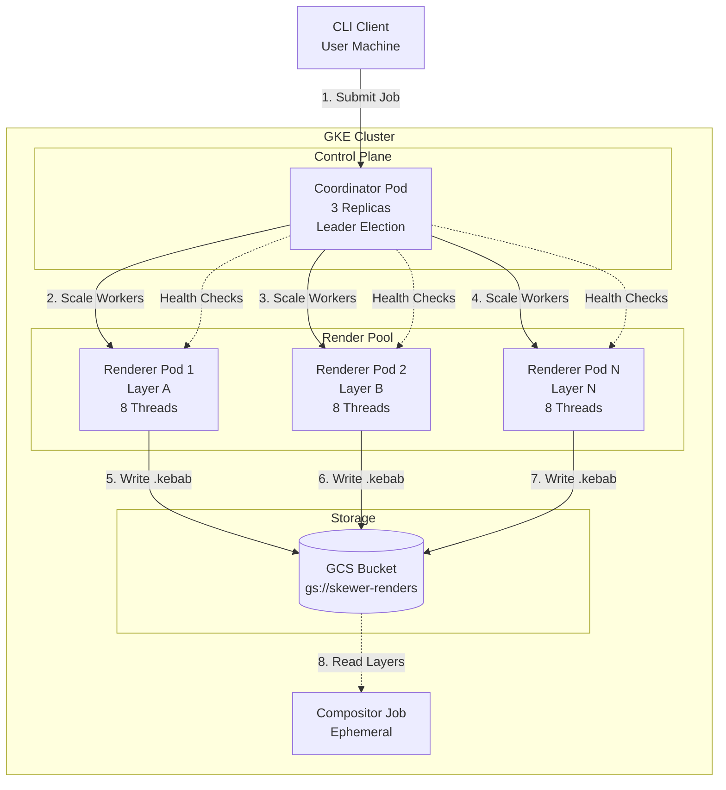
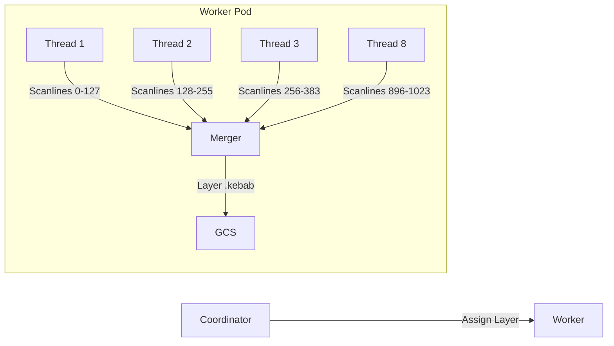

# Skewer Distributed Rendering Engine - Technical Specification

This document contains the comprehensive technical specification for Skewer, a distributed rendering engine built for cost-effective, high-fidelity image rendering on Google Kubernetes Engine (GKE). It consolidates all architectural decisions, implementation patterns, and code examples needed to begin development.

## 1. Project Overview and High-Level Architecture

### 1.1 System Goals

Skewer achieves massive horizontal scaling and fault tolerance to render high-fidelity images cost-effectively. The system is specifically designed to run on Preemptible (Spot) Instances to minimize cloud costs, requiring robust fault tolerance to handle node reclamation gracefully.

### 1.2 Architecture Pattern

The system follows a Controller-Worker (Coordinator-Worker) architecture deployed on GKE:



### 1.3 Component Responsibilities

| Component | Language | Role | Location |
|----------|----------|------|----------|
| CLI | C++ | User interface and process manager. Spawns Coordinator. | Local Machine |
| Coordinator | Go | The "Brain." Manages jobs, schedules layers, provisions workers via K8s API. | GKE Cluster |
| Render Worker | C++ | The "Brawn." Performs heavy path tracing on assigned layers with internal tile threading. | GKE Cluster (Spot) |
| Compositor | C++ | Merges deep layers using interval merge algorithm. | GKE Cluster (Job) |

### 1.4 Technology Stack

- **Control Plane**: Go (Coordinator)
- **Rendering Core**: C++ (Workers, Compositor)
- **Communication**: gRPC with Protobuffers
- **Infrastructure**: Google Kubernetes Engine (GKE)
- **Storage**: Google Cloud Storage (GCS)
- **Container Runtime**: Docker

## 2. Kubernetes Pod Architecture

### 2.1 Design Principles

Understanding the fundamental Kubernetes concepts is essential before diving into the pod designs:

- **Pods are ephemeral**: They can be created, destroyed, and rescheduled at any time.
- **Pods are logical hosts**: Containers within a pod share networking and storage.
- **Services provide stable DNS**: Use Services for internal communication to avoid hardcoded IP addresses.
- **Deployments manage replicas**: Use Deployments for stateless workers that can be scaled horizontally.

### 2.2 Coordinator Pod

The Coordinator serves as the orchestration layer and should run as a Deployment with multiple replicas for high availability. Only one replica should be active at any time using leader election.

```yaml
# coordinator-deployment.yaml
apiVersion: apps/v1
kind: Deployment
metadata:
  name: skewer-coordinator
  labels:
    app: skewer
    component: coordinator
spec:
  replicas: 3
  selector:
    matchLabels:
      app: skewer
      component: coordinator
  template:
    metadata:
      labels:
        app: skewer
        component: coordinator
    spec:
      containers:
      - name: coordinator
        image: gcr.io/YOUR_PROJECT/skewer-coordinator:latest
        ports:
        - containerPort: 50051
          name: grpc
        env:
        - name: GCS_BUCKET
          value: "gs://skewer-renders"
        - name: LEADER_ELECTION_ENABLED
          value: "true"
        - name: KUBERNETES_NAMESPACE
          value: "skewer-system"
        resources:
          requests:
            memory: "512Mi"
            cpu: "500m"
          limits:
            memory: "1Gi"
            cpu: "1000m"
        volumeMounts:
        - name: service-account
          mountPath: /etc/skewer/service-account
          readOnly: true
      volumes:
      - name: service-account
        secret:
          secretName: gcp-service-account
```

```yaml
# coordinator-service.yaml
apiVersion: v1
kind: Service
metadata:
  name: skewer-coordinator
spec:
  selector:
    app: skewer
    component: coordinator
  ports:
  - name: grpc
    port: 50051
    targetPort: 50051
  type: ClusterIP
```

**Key Configuration Details:**

- Three replicas provide high availability. When the active Coordinator crashes or is preempted, Kubernetes promotes a standby replica within seconds.
- The Service provides stable DNS: `skewer-coordinator:50051` resolves to any healthy pod.
- Resource limits ensure consistent performance while preventing resource starvation.
- Runs on on-demand instances (not preemptible) for reliability.

### 2.3 Render Worker Pods

Render workers are the computational engines. Each pod runs a single renderer container that processes an entire object layer using internal multi-threading.

```yaml
# renderer-deployment.yaml
apiVersion: apps/v1
kind: Deployment
metadata:
  name: skewer-renderer
  labels:
    app: skewer
    component: renderer
spec:
  replicas: 0
  selector:
    matchLabels:
      app: skewer
      component: renderer
  template:
    metadata:
      labels:
        app: skewer
        component: renderer
    spec:
      tolerations:
      - key: "cloud.google.com/gke-preemptible"
        operator: "Exists"
        effect: "NoSchedule"
      containers:
      - name: renderer
        image: gcr.io/YOUR_PROJECT/skewer-renderer:latest
        ports:
        - containerPort: 50052
          name: grpc
        env:
        - name: COORDINATOR_ADDR
          value: "skewer-coordinator:50051"
        - name: GCS_BUCKET
          value: "gs://skewer-renders"
        - name: RENDERER_ID
          valueFrom:
            fieldRef:
              fieldPath: metadata.name
        - name: RENDER_THREADS
          value: "8"
        resources:
          requests:
            memory: "8Gi"
            cpu: "8"
          limits:
            memory: "12Gi"
            cpu: "8"
        volumeMounts:
        - name: scratch
          mountPath: /tmp/skewer
      volumes:
      - name: scratch
        emptyDir:
          sizeLimit: "10Gi"
```

**Key Configuration Details:**

- Initial replicas set to 0: the Coordinator scales this up based on job demand.
- Tolerations ensure renderer pods run on preemptible nodes for cost savings (80% discount).
- Environment variables configure the Coordinator address and thread count.
- Memory requests are higher than tile-level distribution because each worker holds an entire layer.
- Ephemeral scratch storage for temporary checkpoint data.

### 2.4 Compositor Pod

The Compositor runs ephemerally as a Kubernetes Job when frames complete. This is cost-effective because you only pay for compositor resources when needed.

```yaml
# compositor-job.yaml
apiVersion: batch/v1
kind: Job
metadata:
  name: skewer-compositor
  labels:
    app: skewer
    component: compositor
spec:
  template:
    metadata:
      labels:
        app: skewer
        component: compositor
    spec:
      restartPolicy: OnFailure
      containers:
      - name: compositor
        image: gcr.io/YOUR_PROJECT/skewer-compositor:latest
        env:
        - name: JOB_ID
          valueFrom:
            fieldRef:
              fieldPath: metadata.labels['job-id']
        - name: GCS_BUCKET
          value: "gs://skewer-renders"
        - name: OUTPUT_PATH
          value: "gs://skewer-output"
        resources:
          requests:
            memory: "2Gi"
            cpu: "2"
          limits:
            memory: "4Gi"
            cpu: "4"
        volumeMounts:
        - name: scratch
          mountPath: /tmp/skewer
      volumes:
      - name: scratch
        emptyDir:
          sizeLimit: "50Gi"
```

**Key Configuration Details:**

- Job runs to completion (success or failure) then terminates.
- Larger scratch storage for intermediate tile processing.
- The Coordinator creates a new Job for each frame that needs compositing.

## 3. Distribution Model: Layer-Level with Multi-Threading

### 3.1 Why Layer-Level Distribution

Layer-level distribution is the correct choice for path tracing workloads for several important reasons:

**Ray Coherence and Cache Efficiency:**

- When rendering an entire object layer on one machine, all threads work on the same geometry, materials, and textures.
- BVH (Bounding Volume Hierarchy) traversal stays cache-friendly because all threads access the same acceleration structure.
- Material data loads once and gets shared across threads.
- Texture memory gets reused rather than reloaded for each tile.

**Reduced Network Overhead:**

- Tile-level: Each worker receives scene data, renders a small tile, uploads result. Many network round-trips.
- Layer-level: Each worker receives scene once, renders entire layer with multiple threads, uploads one result. Much more efficient.

**Better Thread Utilization:**

- Internal threading within workers uses efficient synchronization patterns.
- Threads share memory and can coordinate easily.

### 3.2 Concurrency Model



Each worker renders an entire object layer, internally dividing the work across multiple threads at the scanline or tile level. The threads within a worker can use efficient work-sharing patterns:

```cpp
// worker/renderer.cpp
class LayerRenderer {
private:
    ThreadPool threadPool_;
    int numThreads_;

public:
    LayerRenderer(int numThreads) : numThreads_(numThreads), threadPool_(numThreads) {}

    std::vector<TileResult> RenderLayer(const Layer& layer) {
        // Divide layer into scanline ranges for each thread
        int scanlinesPerThread = layer.height / numThreads_;
        std::vector<ScanlineRange> ranges;

        for (int i = 0; i < numThreads_; ++i) {
            int start = i * scanlinesPerThread;
            int end = (i == numThreads_ - 1) ? layer.height : (i + 1) * scanlinesPerThread;
            ranges.push_back({start, end});
        }

        // Submit work to thread pool
        std::vector<std::future<TileResult>> futures;
        for (const auto& range : ranges) {
            futures.push_back(threadPool_.enqueue([&, range]() {
                return RenderScanlines(layer, range.start, range.end);
            }));
        }

        // Wait for all threads and collect results
        std::vector<TileResult> results;
        for (auto& future : futures) {
            results.push_back(future.get());
        }

        return results;
    }
};
```

### 3.3 Comparison: Layer-Level vs. Tile-Level

| Aspect | Tile-Level | Layer-Level |
|--------|------------|-------------|
| Network overhead | High (many small transfers) | Low (few large transfers) |
| Cache efficiency | Poor (each worker cold start) | Excellent (shared geometry) |
| Load balancing | Fine-grained | Coarse-grained |
| Failure granularity | Small (one tile fails) | Larger (whole layer fails) |
| Memory per worker | Lower | Higher |
| Scaling granularity | Flexible | Limited by layer count |
| Best for | Heterogeneous scenes | Coherent path tracing |

Layer-level is recommended for high-fidelity path tracing where initial scene loading cost is amortized over more rendering work.

## 4. GKE Cost Optimization and Infrastructure

### 4.1 How GKE Machine Types Work

In GKE, you create **node pools** within your cluster, and each node pool uses a specific **machine type**. You must choose the machine type when creating a node pool—GKE does not automatically select machines for you. However, within a node pool, GKE automatically manages the distribution of pods across nodes.

**Key Concepts:**

- **Machine Type**: Defines the vCPU and memory for each node (e.g., `n2-standard-8` has 8 vCPUs and 32GB memory)
- **Node Pool**: A group of nodes with the same machine type
- **Cluster**: Contains one or more node pools

**For Rendering, Recommended Machine Types:**

| Machine Type | vCPUs | Memory | Best For |
|-------------|-------|--------|----------|
| `n2-standard-8` | 8 | 32GB | Balanced workload |
| `n2-standard-16` | 16 | 64GB | Larger scenes |
| `n2-standard-32` | 32 | 128GB | Complex renders |
| `c2-standard-8` | 8 | 32GB | Compute-optimized (faster CPUs) |
| `c2-standard-16` | 16 | 64GB | Compute-heavy scenes |

The `n2` series offers a good balance of cost and performance. The `c2` series has faster CPUs (higher clock speed), which can be beneficial for single-threaded ray tracing performance.

### 4.2 GKE vs. Bare Metal: Understanding the Overhead

You asked about containerization overhead and whether running on 10 static VMs on bare metal would be better. Here's the analysis:

**Containerization Overhead:**

Modern benchmarks show that Kubernetes on VMs achieves **90-110% performance relative to bare metal** for CPU-bound workloads <citation>11</citation>. For ray tracing specifically:

- **CPU-bound rendering**: 2-5% overhead from containerization
- **Memory-bound workloads**: Minimal overhead
- **I/O bound**: Depends on storage configuration

**Why GKE Still Makes Sense:**

| Factor | GKE | Bare Metal VMs |
|--------|-----|----------------|
| **Auto-scaling** | Built-in | Manual management |
| **Fault tolerance** | Automatic rescheduling | You handle it |
| **Spot instances** | Easy to configure | Manual setup |
| **Cost for small scale** | ~$72/month cluster fee | No cluster fee |
| **Cost at scale** | 80-91% savings with Spot | Lower but manual |
| **Operational overhead** | Low | High |

**Recommendation:** For your use case, GKE is the right choice because:

1. **Auto-scaling**: You can scale from 0 to N workers based on job demand
2. **Spot integration**: Easy tolerations for preemptible nodes
3. **Fault tolerance**: Automatic pod rescheduling on failures
4. **Minimal overhead**: 2-5% is acceptable for 80% cost savings

### 4.3 Node Pool Configuration for Cost Optimization

Create separate node pools for different components:

```yaml
# Create a node pool for the Coordinator (on-demand)
gcloud container node-pools create coordinator-pool \
  --cluster=skewer-cluster \
  --machine-type=n2-standard-4 \
  --num-nodes=3 \
  --enable-autoscaling=false

# Create a node pool for Renderers (Spot/Preemptible)
gcloud container node-pools create renderer-pool \
  --cluster=skewer-cluster \
  --machine-type=n2-standard-16 \
  --num-nodes=0 \
  --enable-autoscaling=true \
  --min-nodes=0 \
  --max-nodes=50 \
  --spot
```

**Key Configuration:**

- **Coordinator pool**: On-demand instances (3 nodes, always running)
- **Renderer pool**: Spot instances (0-50 nodes, auto-scaled)

### 4.4 Kubernetes Manifests with Node Selection

```yaml
# coordinator-deployment.yaml (runs on on-demand nodes)
apiVersion: apps/v1
kind: Deployment
metadata:
  name: skewer-coordinator
spec:
  replicas: 3
  template:
    spec:
      # No tolerations - runs on regular on-demand nodes
      nodeSelector:
        workload: coordinator
      containers:
      - name: coordinator
        image: gcr.io/YOUR_PROJECT/skewer-coordinator:latest
        resources:
          requests:
            memory: "512Mi"
            cpu: "500m"
```

```yaml
# renderer-deployment.yaml (runs on Spot nodes)
apiVersion: apps/v1
kind: Deployment
metadata:
  name: skewer-renderer
spec:
  replicas: 0  # Start at 0, scale based on demand
  template:
    spec:
      tolerations:
      - key: "cloud.google.com/gke-preemptible"
        operator: "Exists"
        effect: "NoSchedule"
      nodeSelector:
        workload: renderer
      containers:
      - name: renderer
        image: gcr.io/YOUR_PROJECT/skewer-renderer:latest
        resources:
          requests:
            memory: "8Gi"
            cpu: "8"
```

### 4.5 Cost Breakdown Example

**Scenario:** Rendering 100 frames with 20 layers each

| Component | Configuration | Cost (US East) |
|-----------|--------------|----------------|
| Cluster Management | 1 cluster | $0.08/day ($2.40/month) |
| Coordinator | 3 × n2-standard-4 (on-demand) | ~$0.62/hour |
| Renderer (avg) | 10 × n2-standard-16 (Spot) | ~$0.80/hour |
| Renderer (peak) | 30 × n2-standard-16 (Spot) | ~$2.40/hour |
| GCS Storage | 100GB | ~$0.02/hour |
| Network egress | Variable | ~$0.02/hour |

**Estimated Costs:**

- Idle cluster (Coordinator only): ~$15/day
- Active rendering (20 renderer pool): ~$45/day
- Monthly (with regular rendering): ~$500-800/month

This is significantly cheaper than on-demand instances (which would be $200-400/day).

### 4.6 Cost Optimization Best Practices

1. **Use Spot for Render Workers**: 80-91% savings
2. **Scale to Zero**: Set renderer replicas to 0 when idle
3. **Right-size Node Pools**: Match machine type to workload
4. **Use Labels and Taints**: Ensure Coordinator runs on cheaper nodes
5. **Monitor with Cloud Logging**: Track actual usage vs. costs
6. **Set Budget Alerts**: Get notified when costs exceed threshold

```yaml
# Set up budget alert (via Cloud Billing console)
# Budget: $1000/month
# Alert: 50%, 90%, 100%
```

### 4.7 Summary: Recommendation

**Recommended Approach:**

- Use **GKE Standard mode** (not Autopilot) for full control
- Create two node pools:
  - **Coordinator**: 3 nodes, `n2-standard-4`, on-demand
  - **Renderers**: 0-50 nodes, `n2-standard-16` or `c2-standard-8`, Spot
- Let Kubernetes handle pod scheduling within node pools
- Scale renderer pool based on pending layers (via Horizontal Pod Autoscaler or custom Controller logic)

This approach gives you:
- Minimal containerization overhead (2-5%)
- Massive cost savings (80-91%)
- Easy horizontal scaling
- Built-in fault tolerance

**Alternative (if you need absolute maximum performance):**

- Consider **GKE on Bare Metal** (Anthos) if available
- Or run your own Kubernetes cluster on dedicated hardware
- This eliminates virtualization overhead but increases operational complexity

## 5. gRPC Communication Protocol

### 5.1 Protocol Buffer Definitions

Define the service contract in Protobufs for type-safe communication between Coordinator and Workers.

```protobuf
// proto/skewer.proto
syntax = "proto3";

package skewer.v1;

option go_package = "skewer/pkg/api";

// ============ Coordinator Service ============

service CoordinatorService {
    // Worker registration and lifecycle
    rpc RegisterWorker(RegisterWorkerRequest) returns (RegisterWorkerResponse);
    rpc WorkerHeartbeat(WorkerHeartbeatRequest) returns (WorkerHeartbeatResponse);
    rpc UnregisterWorker(UnregisterWorkerRequest) returns (UnregisterWorkerResponse);

    // Job submission
    rpc SubmitJob(SubmitJobRequest) returns (SubmitJobResponse);
    rpc GetJobStatus(GetJobStatusRequest) returns (GetJobStatusResponse);
    rpc CancelJob(CancelJobRequest) returns (CancelJobResponse);

    // Layer operations
    rpc GetLayerAssignment(GetLayerAssignmentRequest) returns (GetLayerAssignmentResponse);
    rpc SubmitLayerResult(SubmitLayerResultRequest) returns (SubmitLayerResultResponse);
}

// ============ Worker Service (for Coordinator to push work) ============

service WorkerService {
    rpc ReceiveLayer(ReceiveLayerRequest) returns (ReceiveLayerResponse);
    rpc CancelCurrentWork(CancelWorkRequest) returns (CancelWorkResponse);
}

// ============ Messages ============

message RegisterWorkerRequest {
    string worker_id = 1;
    WorkerCapabilities capabilities = 2;
    string pod_name = 3;
}

message WorkerCapabilities {
    int32 cpu_count = 1;
    int64 memory_bytes = 2;
    bool has_gpu = 3;
    int32 gpu_count = 4;
}

message RegisterWorkerResponse {
    bool accepted = 1;
    string coordinator_id = 2;
    int64 heartbeat_interval_seconds = 3;
}

message WorkerHeartbeatRequest {
    string worker_id = 1;
    WorkerStatus status = 2;
    int32 current_load = 3;
    LayerProgress current_layer = 4;
}

enum WorkerStatus {
    WORKER_STATUS_IDLE = 0;
    WORKER_STATUS_RENDERING = 1;
    WORKER_STATUS_UPLOADING = 2;
    WORKER_STATUS_DRAINING = 3;
}

message LayerProgress {
    string layer_id = 1;
    int32 scanlines_completed = 2;
    int32 total_scanlines = 3;
    int32 samples_completed = 4;
    int32 target_samples = 5;
}

message WorkerHeartbeatResponse {
    LayerAssignment next_assignment = 1;
    bool should_drain = 2;
}

message SubmitJobRequest {
    string scene_uri = 1;
    int32 frame_number = 2;
    int32 target_samples = 3;
    int32 tile_size = 4;
    repeated LayerSpec layers = 5;
    string output_uri = 6;
}

message LayerSpec {
    string layer_id = 1;
    string object_range = 2;
    int32 priority = 3;
}

message SubmitJobResponse {
    string job_id = 1;
}

message GetJobStatusRequest {
    string job_id = 1;
}

message GetJobStatusResponse {
    JobStatus status = 1;
    int32 completed_layers = 2;
    int32 total_layers = 3;
    float progress_percentage = 4;
}

enum JobStatus {
    JOB_STATUS_PENDING = 0;
    JOB_STATUS_IN_PROGRESS = 1;
    JOB_STATUS_COMPOSITING = 2;
    JOB_STATUS_COMPLETED = 3;
    JOB_STATUS_FAILED = 4;
    JOB_STATUS_CANCELLED = 5;
}

message LayerAssignment {
    string layer_id = 1;
    string job_id = 2;
    string scene_uri = 3;
    string object_range = 4;
    string output_uri = 5;
    int32 target_samples = 6;
}

message SubmitLayerResultRequest {
    string worker_id = 1;
    string layer_id = 2;
    string kebab_uri = 3;
    int32 scanlines_rendered = 4;
    int32 samples_completed = 5;
    int64 render_time_ms = 6;
}

message SubmitLayerResultResponse {
    bool accepted = 1;
}
```

### 4.2 Go Coordinator Implementation

The Coordinator is a Go program that implements the gRPC service definition and handles job scheduling.

```go
// cmd/coordinator/main.go
package main

import (
    "context"
    "log"
    "net"
    "sync"
    "time"

    "google.golang.org/grpc"
    "google.golang.org/grpc/keepalive"
    "google.golang.org/grpc/reflection"
    "k8s.io/client-go/kubernetes"
    "k8s.io/client-go/tools/clientcmd"

    "skewer/pkg/api"
    "skewer/pkg/scheduler"
    "skewer/pkg/store"
)

type CoordinatorServer struct {
    api.UnimplementedCoordinatorServer

    kubeClient  *kubernetes.Clientset
    jobStore    store.JobStore
    scheduler   *scheduler.Scheduler
    workerMgr   *scheduler.WorkerManager
    mu          sync.RWMutex
    isLeader    bool
}

func main() {
    // Load Kubernetes configuration (in-cluster or local)
    config, err := clientcmd.BuildConfigFromFlags("", "")
    if err != nil {
        log.Fatalf("Failed to load kubeconfig: %v", err)
    }

    // Create Kubernetes client
    kubeClient, err := kubernetes.NewForConfig(config)
    if err != nil {
        log.Fatalf("Failed to create kube client: %v", err)
    }

    // Initialize components
    jobStore := store.NewPostgresJobStore(getEnv("DATABASE_URL", "postgres://localhost:5432/skewer"))
    workerMgr := scheduler.NewWorkerManager(kubeClient, "skewer-renderer")
    sched := scheduler.NewScheduler(jobStore, workerMgr)

    // Create server
    server := &CoordinatorServer{
        kubeClient: kubeClient,
        jobStore:   jobStore,
        scheduler: sched,
        workerMgr: workerMgr,
    }

    // Start gRPC server
    lis, err := net.Listen("tcp", ":50051")
    if err != nil {
        log.Fatalf("Failed to listen: %v", err)
    }

    grpcServer := grpc.NewServer(
        grpc.KeepaliveParams(keepalive.ServerParameters{
            MaxConnectionIdle: 60 * time.Second,
            Timeout: 10 * time.Second,
        }),
        grpc.MaxConcurrentStreams(100),
        grpc.MaxRecvMsgSize(100 * 1024 * 1024),  // 100MB for large requests
    )

    api.RegisterCoordinatorServiceServer(grpcServer, server)
    reflection.Register(grpcServer)  // For gRPC CLI

    log.Println("Coordinator starting on :50051")
    if err := grpcServer.Serve(lis); err != nil {
        log.Fatalf("Failed to serve: %v", err)
    }
}

// SubmitJob handles new render job submissions
func (s *CoordinatorServer) SubmitJob(ctx context.Context, req *api.SubmitJobRequest) (*api.SubmitJobResponse, error) {
    job := &api.Job{
        Id:               generateJobID(),
        SceneUri:         req.SceneUri,
        Frame:            req.FrameNumber,
        TargetSamples:    req.TargetSamples,
        TileSize:         req.TileSize,
        OutputUri:        req.OutputUri,
        Status:           api.JobStatus_JOB_STATUS_PENDING,
        CreatedAt:        time.Now().Unix(),
    }

    // Create layers from specifications
    for _, layerSpec := range req.Layers {
        job.Layers = append(job.Layers, &api.Layer{
            Id:          layerSpec.LayerId,
            JobId:       job.Id,
            ObjectRange: layerSpec.ObjectRange,
            Priority:    layerSpec.Priority,
            Status:      api.LayerStatus_LAYER_STATUS_PENDING,
        })
    }

    // Save job to store
    if err := s.jobStore.Create(ctx, job); err != nil {
        return nil, err
    }

    // Add layers to scheduler
    for _, layer := range job.Layers {
        s.scheduler.EnqueueLayer(layer)
    }

    // Scale up renderer workers based on demand
    pendingCount := s.scheduler.PendingLayerCount()
    s.workerMgr.ScaleTo(pendingCount)

    return &api.SubmitJobResponse{JobId: job.Id}, nil
}

// WorkerHeartbeat handles worker registration and work assignment
func (s *CoordinatorServer) WorkerHeartbeat(ctx context.Context, req *api.WorkerHeartbeatRequest) (*api.WorkerHeartbeatResponse, error) {
    s.workerMgr.UpdateWorker(req.WorkerId, req.Status, req.CurrentLoad)

    // Check if worker was working on a layer that's now complete
    if req.CurrentLayer != nil {
        s.scheduler.UpdateLayerProgress(req.WorkerId, req.CurrentLayer)
    }

    // Assign new work if worker is idle
    if req.Status == api.WorkerStatus_WORKER_STATUS_IDLE {
        if assignment := s.scheduler.AssignWork(req.WorkerId); assignment != nil {
            return &api.WorkerHeartbeatResponse{
                NextAssignment: assignment,
            }, nil
        }
    }

    return &api.WorkerHeartbeatResponse{}, nil
}

// SubmitLayerResult handles completed layer uploads
func (s *CoordinatorServer) SubmitLayerResult(ctx context.Context, req *api.SubmitLayerResultRequest) (*api.SubmitLayerResultResponse, error) {
    err := s.scheduler.MarkLayerComplete(req.LayerId, req.KebabUri, req.RenderTimeMs)
    if err != nil {
        return &api.SubmitLayerResultResponse{Accepted: false}, err
    }

    // Check if job is complete
    if s.scheduler.IsJobComplete(req.LayerId) {
        // Trigger compositor job
        go s.scheduler.TriggerCompositor(req.LayerId)
    }

    // Re-balance workers
    pendingCount := s.scheduler.PendingLayerCount()
    s.workerMgr.ScaleTo(pendingCount)

    return &api.SubmitLayerResultResponse{Accepted: true}, nil
}

// RegisterWorker handles new worker registration
func (s *CoordinatorServer) RegisterWorker(ctx context.Context, req *api.RegisterWorkerRequest) (*api.RegisterWorkerResponse, error) {
    s.workerMgr.RegisterWorker(req.WorkerId, req.PodName, req.Capabilities)

    return &api.RegisterWorkerResponse{
        Accepted:                  true,
        CoordinatorId:             "skewer-coordinator",
        HeartbeatIntervalSeconds:  10,
    }, nil
}

func getEnv(key, defaultValue string) string {
    if value := os.Getenv(key); value != "" {
        return value
    }
    return defaultValue
}

func generateJobID() string {
    return fmt.Sprintf("job-%d-%s", time.Now().Unix(), randomString(8))
}
```

### 4.3 C++ Worker Implementation

Workers inherit from the generated protobuf service class to implement rendering logic.

```cpp
// worker/renderer_service.cpp
#include <grpcpp/grpcpp.h>
#include "skewer.pb.h"
#include "skewer.grpc.pb.h"
#include "layer_renderer.h"

class RendererServiceImpl final : public skewer::v1::WorkerService::Service {
private:
    std::unique_ptr<LayerRenderer> renderer_;
    std::string workerId_;
    GCSClient gcsClient_;

public:
    RendererServiceImpl(const std::string& workerId, const GCSConfig& gcsConfig)
        : workerId_(workerId), gcsClient_(gcsConfig) {
        renderer_ = std::make_unique<LayerRenderer>(std::thread::hardware_concurrency());
    }

    ::grpc::Status ReceiveLayer(::grpc::ServerContext* context,
                                const ::skewer::v1::ReceiveLayerRequest* request,
                                ::skewer::v1::ReceiveLayerResponse* response) override {
        try {
            // Download scene data from GCS
            Scene scene = LoadSceneFromGCS(request->scene_uri());

            // Get layer configuration
            LayerConfig config;
            config.layerId = request->layer_id();
            config.objectRange = request->object_range();
            config.targetSamples = request->target_samples();
            config.outputUri = request->output_uri();

            // Render the layer with internal threading
            auto results = renderer_->RenderLayer(scene, config);

            // Write to .kebab format
            std::string kebabData = WriteKebabFile(results, config);

            // Upload to GCS
            std::string uploadedUri = gcsClient_.Upload(config.outputUri, kebabData);

            response->set_success(true);
            response->set_output_uri(uploadedUri);
            response->set_scanlines_rendered(config.height);
            response->set_samples_completed(config.targetSamples);

        } catch (const std::exception& e) {
            response->set_success(false);
            response->set_error_message(e.what());
        }

        return ::grpc::Status::OK;
    }

private:
    Scene LoadSceneFromGCS(const std::string& uri) {
        // Download scene file from GCS
        auto data = gcsClient_.Download(uri);
        return Scene::Deserialize(data);
    }
};

// Main entry point
int main(int argc, char** argv) {
    std::string coordinatorAddr = getenv("COORDINATOR_ADDR") ?: "localhost:50051";
    std::string workerId = getenv("RENDERER_ID");

    GCSConfig gcsConfig;
    gcsConfig.bucket = getenv("GCS_BUCKET");

    // Create gRPC server
    std::string serverAddress = "0.0.0.0:50052";
    RendererServiceImpl service(workerId, gcsConfig);

    grpc::ServerBuilder builder;
    builder.AddListeningPort(serverAddress, grpc::InsecureServerCredentials());
    builder.RegisterService(&service);

    std::unique_ptr<grpc::Server> server(builder.BuildAndStart());

    // Register with coordinator
    RegisterWithCoordinator(coordinatorAddr, workerId);

    // Start heartbeat loop
    StartHeartbeatLoop(coordinatorAddr, workerId);

    server->Wait();
}
```

## 6. .kebab Format Specification

### 6.1 Format Design Principles

The .kebab format is a custom binary format used as the intermediate format between renderers and the compositor. Unlike compressed formats, .kebab is kept uncompressed because:

1. **Direct Compositor Usage**: The compositor reads .kebab files directly to perform deep compositing. Compression would require decompression overhead that defeats the purpose of a fast I/O format.
2. **Sequential Write Performance**: Tiles are written once during rendering and read once during compositing.
3. **Fast Indexing**: Random access to any tile without scanning the entire file.
4. **OpenEXR to Kebab Pipeline**: Renderers first output to OpenEXR (for storage efficiency), then "thaw" (convert) EXR data into .kebab format for the compositor.

### 6.2 Format Structure

```
┌────────────────────────────────────────────────────────────┐
│ Magic Number (4 bytes): "KEBB"                           │
│ Version (2 bytes): 0x0001                                 │
│ Layer ID (32 bytes): UUID string                          │
│ Frame Number (4 bytes)                                     │
│ Tile Count (4 bytes)                                      │
│ Total Scanlines (4 bytes)                                 │
│ Samples Per Pixel (4 bytes)                               │
├────────────────────────────────────────────────────────────┤
│                    Tile Index Section                       │
│  ┌──────────────────────────────────────────────────────┐ │
│  │ Tile 0:                                              │ │
│  │   offset (8 bytes), size (4 bytes),                  │ │
│  │   x (4 bytes), y (4 bytes), width (4 bytes),         │ │
│  │   height (4 bytes), sample_count (4 bytes)          │ │
│  │ Tile 1: ...                                          │ │
│  │ ...                                                  │ │
│  └──────────────────────────────────────────────────────┘ │
├────────────────────────────────────────────────────────────┤
│                    Tile Data Section                        │
│  ┌──────────────────────────────────────────────────────┐ │
│  │ Tile 0: [Uncompressed deep pixel data]              │ │
│  │ Tile 1: [Uncompressed deep pixel data]              │ │
│  │ ...                                                  │ │
│  └──────────────────────────────────────────────────────┘ │
└────────────────────────────────────────────────────────────┘
```

### 6.3 Rendering Pipeline: OpenEXR to Kebab

The rendering workflow involves converting from OpenEXR to .kebab:

```cpp
// worker/render_pipeline.cpp

class RenderPipeline {
public:
    void RenderAndConvert(const Layer& layer, const RenderConfig& config) {
        // Step 1: Render to OpenEXR (efficient storage)
        std::string exrPath = RenderToOpenEXR(layer, config);

        // Step 2: Thaw EXR to Kebab (for compositor)
        std::vector<char> exrData = ReadOpenEXR(exrPath);
        DeepEXRConverter converter;
        auto deepPixels = converter.Parse(exrData);

        // Step 3: Write to .kebab (uncompressed for compositor)
        KebabWriter writer(config.outputKebabPath);
        writer.WriteHeader(CreateHeader(layer, config));
        for (const auto& tile : deepPixels.tiles) {
            writer.WriteTile(tile);
        }
        writer.Close();

        // Step 4: Upload to GCS
        gcsClient_.Upload(config.outputUri, config.outputKebabPath);
    }
};
```

**Storage vs. Compositing Flow:**

```
Renderer                          Compositor
    │                                   │
    ├─ Render to OpenEXR (compressed)  │
    ├─ Upload to GCS (storage)         │
    │                                   │
    ├─ Thaw EXR to Kebab (uncompressed)│
    ├─ Upload Kebab to GCS ────────────┼── Download
    │                                   │
    └─ Done                            ├─ Read Kebab
                                        ├─ Interval Merge
                                        └─ Output Final EXR
```

### 6.4 C++ Implementation (Uncompressed)

```cpp
// kebab/writer.h
#pragma once

#include <fstream>
#include <vector>
#include <cstdint>
#include <string>

namespace skewer {
namespace kebab {

struct TileIndexEntry {
    uint64_t offset;      // Offset in file where tile data starts
    uint32_t size;        // Size of tile data in bytes
    uint32_t x;           // Tile origin X
    uint32_t y;           // Tile origin Y
    uint32_t width;       // Tile width
    uint32_t height;      // Tile height
    uint32_t sampleCount; // Samples per pixel for this tile
};

struct KebabHeader {
    char magic[4];           // "KEBB"
    uint16_t version;        // Format version
    char layerId[32];        // UUID
    uint32_t frameNumber;    // Frame number
    uint32_t tileCount;      // Number of tiles
    uint32_t totalScanlines; // Total scanlines
    uint32_t samplesPerPixel;// Target samples
};

class KebabWriter {
private:
    std::ofstream file_;
    std::vector<TileIndexEntry> index_;
    uint64_t dataOffset_;

public:
    KebabWriter(const std::string& filepath);
    ~KebabWriter();

    void WriteHeader(const KebabHeader& header);
    // Write uncompressed tile data directly
    void WriteTile(const TileIndexEntry& entry, const void* data, size_t size);
    void Close();
};

// kebab/reader.h
class KebabReader {
private:
    std::ifstream file_;
    KebabHeader header_;
    std::vector<TileIndexEntry> index_;

public:
    KebabReader(const std::string& filepath);

    const KebabHeader& GetHeader() const { return header_; }
    size_t GetTileCount() const { return index_.size(); }

    // Read uncompressed tile data
    void ReadTile(size_t tileIndex, void* buffer, size_t* size);

    // Streaming read for large tiles
    void ReadTileStreaming(size_t tileIndex,
                         std::function<void(const char*, size_t)> callback);
};

} // namespace kebab
} // namespace skewer
```

```cpp
// kebab/writer.cpp
#include "writer.h"

namespace skewer {
namespace kebab {

KebabWriter::KebabWriter(const std::string& filepath)
    : dataOffset_(0) {
    file_.open(filepath, std::ios::binary);
}

void KebabWriter::WriteHeader(const KebabHeader& header) {
    file_.write(reinterpret_cast<const char*>(&header), sizeof(KebabHeader));
    // Reserve space for index (will be filled on Close)
    dataOffset_ = sizeof(KebabHeader) + header.tileCount * sizeof(TileIndexEntry);
}

void KebabWriter::WriteTile(const TileIndexEntry& entry,
                           const void* rawData, size_t rawSize) {
    // Write UNCOMPRESSED tile data directly
    // This is critical: compositor reads .kebab directly without decompression

    // Update index entry with actual offset
    TileIndexEntry entryWithOffset = entry;
    entryWithOffset.offset = dataOffset_;
    entryWithOffset.size = static_cast<uint32_t>(rawSize);
    index_.push_back(entryWithOffset);

    // Write uncompressed data directly
    file_.write(reinterpret_cast<const char*>(rawData), rawSize);
    dataOffset_ += rawSize;
}

void KebabWriter::Close() {
    // Write index section at the end
    uint64_t indexOffset = dataOffset_;
    for (const auto& entry : index_) {
        file_.write(reinterpret_cast<const char*>(&entry), sizeof(TileIndexEntry));
    }

    // Go back and update header with index offset (for future readers)
    file_.seekp(0);
    KebabHeader h = {};  // Load header...
    h.indexOffset = indexOffset;
    file_.write(reinterpret_cast<const char*>(&h), sizeof(KebabHeader));

    file_.close();
}

} // namespace kebab
} // namespace skewer
```

### 6.5 Storage Strategy

The two-tier storage strategy optimizes both cost and performance:

| Storage Type | Format | Compression | Purpose |
|-------------|--------|-------------|---------|
| Long-term Storage | OpenEXR | Yes (lossless) | Archival, version control |
| Compositing Cache | .kebab | No | Fast compositor I/O |

This approach saves storage costs (OpenEXR is much smaller than uncompressed) while maintaining fast compositor performance (.kebab requires no decompression).

## 7. Fault Tolerance for Spot Instances

### 7.1 Understanding Spot Instance Behavior

Google Cloud Preemptible VMs provide 80% cost savings but can be reclaimed with a 30-second warning. Kubernetes sends SIGTERM, then SIGKILL after the grace period. Your fault tolerance strategy must address preemption detection, progress loss, and state consistency.

### 7.2 Checkpointing Strategy

Implement a tiered checkpointing system:

```cpp
// checkpoint/checkpoint_manager.h
#pragma once

#include <string>
#include <chrono>
#include <thread>
#include <atomic>

namespace skewer {
namespace checkpoint {

struct TileCheckpoint {
    std::string tileId;
    std::string layerId;
    std::string jobId;

    uint32_t x, y;
    uint32_t width, height;

    uint64_t samplesCompleted;
    std::vector<char> partialBuffer;  // Compressed pixel data

    std::chrono::steady_clock::time_point timestamp;
    std::string workerId;
};

class CheckpointManager {
private:
    std::string gcsBucket_;
    std::atomic<bool> running_;
    std::chrono::seconds interval_;
    std::thread checkpointThread_;

public:
    CheckpointManager(const std::string& gcsBucket,
                     std::chrono::seconds interval = std::chrono::seconds(10));
    ~CheckpointManager();

    // Call periodically during rendering
    void SaveCheckpoint(const TileCheckpoint& checkpoint);

    // Load checkpoint for recovery
    std::optional<TileCheckpoint> LoadCheckpoint(const std::string& layerId);

    // Check if checkpoint exists
    bool HasCheckpoint(const std::string& layerId);

    void Start();
    void Stop();

private:
    void CheckpointLoop();
    std::string GetCheckpointPath(const std::string& layerId);
};

} // namespace checkpoint
} // namespace skewer
```

### 7.3 Graceful Degradation Protocol

**Worker Side (when receiving SIGTERM):**

```cpp
void Worker::HandlePreemptionSignal() {
    // 1. Immediately pause new tile acceptance
    acceptingNewWork_ = false;

    // 2. Flush current progress to checkpoint
    SaveCheckpoint(currentLayerProgress_);

    // 3. Signal coordinator we're draining
    SendDrainingStatus();

    // 4. Complete current work if within grace period, otherwise exit
    if (timeRemaining() > timeToCompleteCurrentTile()) {
        CompleteCurrentTile();
        UploadResults();
    } else {
        // Just checkpoint and exit
    }

    Exit(0);
}
```

**Coordinator Side (when detecting worker failure):**

```go
// scheduler/fault_tolerance.go
func (s *Scheduler) HandleWorkerFailure(workerID string) {
    s.mu.Lock()
    defer s.mu.Unlock()

    // Find what this worker was processing
    for i, layer := range s.pendingLayers {
        if layer.AssignedTo == workerID && layer.Status == InProgress {
            // Mark as failed, will be re-queued
            layer.Status = Pending
            layer.AssignedTo = ""
            layer.Attempts++

            // Check for existing checkpoint
            if checkpointMgr.HasCheckpoint(layer.ID) {
                layer.CheckpointAvailable = true
            }

            // Re-queue for another worker
            s.pendingLayers = append(s.pendingLayers, layer)

            // Track failure for monitoring
            s.metrics.RecordWorkerFailure(workerID, layer.ID)

            // Exponential backoff for retries
            if layer.Attempts < 3 {
                log.Printf("Layer %s will retry (attempt %d)", layer.ID, layer.Attempts)
            } else {
                s.job.Error = fmt.Sprintf("Layer %s failed after 3 attempts", layer.ID)
            }
        }
    }

    // Re-balance workers
    pendingCount := s.scheduler.PendingLayerCount()
    s.workerMgr.ScaleTo(pendingCount)
}
```

### 7.4 Recovery Workflow

When a failed worker is replaced:

```go
// scheduler/recovery.go
func (s *Scheduler) RecoverLayer(assignment *LayerAssignment) *LayerAssignment {
    // Check if there's a checkpoint
    if checkpoint, err := s.checkpointMgr.LoadCheckpoint(assignment.LayerId); err == nil {
        assignment.CheckpointData = checkpoint
        assignment.RecoverFromCheckpoint = true
    }

    return assignment
}
```

The worker loads the checkpoint and continues from where it left off:

```cpp
void LayerRenderer::RecoverFromCheckpoint(const Checkpoint& checkpoint) {
    // Load partial buffer
    auto partialData = LoadFromGCS(checkpoint.partialBufferUri);

    // Continue rendering from sample count
    int remainingSamples = checkpoint.targetSamples - checkpoint.samplesCompleted;
    RenderRemainingSamples(partialData, remainingSamples);
}
```

## 8. Deep Compositing Algorithm

### 8.1 The Problem

Deep images differ from flat images because each pixel contains multiple samples with depth ranges. Merging two deep images is an **Interval Merge** problem, not a simple "A over B" operation.

### 8.2 Interval Merge Algorithm

```cpp
// compositor/interval_merge.h
#pragma once

#include <vector>
#include <cstdint>

namespace skewer {
namespace compositor {

struct DeepSample {
    float r, g, b;     // RGB color
    float a;            // Alpha
    float zFront;       // Near depth
    float zBack;        // Far depth
};

struct DeepPixel {
    std::vector<DeepSample> samples;
};

// 5-Step Merge Algorithm
class IntervalMerge {
public:
    static DeepPixel Merge(const DeepPixel& a, const DeepPixel& b);

private:
    // Step 1: Boundary Collection
    static std::vector<float> CollectBoundaries(const DeepPixel& a, const DeepPixel& b);

    // Step 2: Interval Generation
    static std::vector<std::pair<float, float>>
    GenerateIntervals(const std::vector<float>& boundaries);

    // Step 3: Sample Splitting & Alpha Correction
    static std::vector<DeepSample>
    SplitSample(const DeepSample& sample,
                float newZFront, float newZBack);

    // Alpha correction formula:
    // A_new = 1 - (1 - A_orig)^(T_new / T_orig)
    static float CorrectAlpha(float originalAlpha,
                             float originalThickness,
                             float newThickness);

    // Step 4: Normalization (Sorting)
    static std::vector<DeepSample>
    SortByDepth(std::vector<DeepSample>& samples);

    // Step 5: Flattening ("Over" Operator)
    static DeepSample Flatten(const std::vector<DeepSample>& sorted);
};

} // namespace compositor
} // namespace skewer
```

```cpp
// compositor/interval_merge.cpp
#include "interval_merge.h"

namespace skewer {
namespace compositor {

DeepPixel IntervalMerge::Merge(const DeepPixel& a, const DeepPixel& b) {
    // Step 1: Collect all boundaries
    std::vector<float> boundaries = CollectBoundaries(a, b);

    // Step 2: Generate intervals
    auto intervals = GenerateIntervals(boundaries);

    // Step 3 & 4: Split samples and sort
    std::vector<DeepSample> allSamples;

    for (const auto& interval : intervals) {
        float zFront = interval.first;
        float zBack = interval.second;

        // Split samples from image A
        for (const auto& sample : a.samples) {
            if (Overlaps(sample, zFront, zBack)) {
                auto split = SplitSample(sample, zFront, zBack);
                allSamples.insert(allSamples.end(), split.begin(), split.end());
            }
        }

        // Split samples from image B
        for (const auto& sample : b.samples) {
            if (Overlaps(sample, zFront, zBack)) {
                auto split = SplitSample(sample, zFront, zBack);
                allSamples.insert(allSamples.end(), split.begin(), split.end());
            }
        }
    }

    // Step 4: Sort by depth
    auto sorted = SortByDepth(allSamples);

    // Step 5: Flatten
    DeepPixel result;
    result.samples.push_back(Flatten(sorted));

    return result;
}

float IntervalMerge::CorrectAlpha(float originalAlpha,
                                 float originalThickness,
                                 float newThickness) {
    if (originalThickness <= 0 || newThickness <= 0) {
        return originalAlpha;
    }
    return 1.0f - std::pow(1.0f - originalAlpha, newThickness / originalThickness);
}

DeepSample IntervalMerge::Flatten(const std::vector<DeepSample>& sorted) {
    DeepSample result = {0, 0, 0, 0};
    float finalAlpha = 0.0f;

    for (const auto& sample : sorted) {
        float remainingVisibility = 1.0f - finalAlpha;
        result.r += sample.r * remainingVisibility;
        result.g += sample.g * remainingVisibility;
        result.b += sample.b * remainingVisibility;
        finalAlpha += remainingVisibility * sample.a;

        if (finalAlpha >= 1.0f) break;  // Optimization: Early exit
    }

    result.a = finalAlpha;
    return result;
}

} // namespace compositor
} // namespace skewer
```

## 9. Implementation Roadmap

### Phase 1: Core Infrastructure (Weeks 1-3)

1. Set up Go workspace and generate protobuf code
2. Implement Coordinator skeleton with job submission
3. Create basic C++ worker with gRPC client
4. Set up Docker build pipeline

**Deliverables:**

- `go.mod` with dependencies
- Generated `.pb.go` files from proto definitions
- Basic Coordinator server accepting jobs
- C++ worker connecting to Coordinator

### Phase 2: Local Development (Weeks 4-6)

1. Implement layer assignment scheduler
2. Add worker health checks and heartbeats
3. Create .kebab file writer/reader in C++
4. Build local end-to-end test loop

**Deliverables:**

- Working Coordinator scheduling layers to workers
- Workers rendering layers and writing .kebab files
- Basic status reporting from workers

### Phase 3: Kubernetes Integration (Weeks 7-9)

1. Dockerize all components
2. Create Kubernetes manifests (Deployment, Service, Job)
3. Implement Coordinator scaling logic
4. Add GCS integration for file storage

**Deliverables:**

- Docker images for Coordinator, Worker, Compositor
- Kubernetes manifests deployable to GKE
- Auto-scaling renderer deployment based on queue depth

### Phase 4: Fault Tolerance (Weeks 10-12)

1. Implement checkpointing system
2. Add spot instance preemption handling
3. Build job recovery logic
4. Implement worker rebalancing

**Deliverables:**

- Periodic checkpointing to GCS
- Graceful worker shutdown on SIGTERM
- Job recovery from checkpoints
- Metrics and monitoring

### Phase 5: Optimization (Weeks 13-16)

1. Tune compression settings
2. Optimize network batching
3. Add performance metrics
4. Load testing at scale

**Deliverables:**

- Optimized .kebab compression
- Network performance improvements
- Dashboard with rendering metrics
- Production readiness

## 10. Environment Setup

### 10.1 Prerequisites

```bash
# Install Go (1.21+)
curl -sL https://go.dev/dl/go1.21.0.linux-amd64.tar.gz | sudo tar -C /usr/local -xzf -

# Install Protocol Buffer compiler
sudo apt-get install -y protobuf-compiler

# Install Go protobuf plugins
go install google.golang.org/protobuf/cmd/protoc-gen-go@latest
go install google.golang.org/grpc/cmd/protoc-gen-go-grpc@latest

# Install Docker
sudo apt-get install -y docker.io

# Install kubectl
curl -LO "https://dl.k8s.io/release/$(curl -L -s https://dl.k8s.io/release/stable.txt)/bin/linux/amd64/kubectl"

# Install gcloud SDK
curl https://sdk.cloud.google.com | bash
```

### 10.2 Project Structure

```
skewer/
├── cmd/
│   ├── coordinator/
│   │   └── main.go
│   ├── worker/
│   │   └── main.cpp
│   └── compositor/
│       └── main.cpp
├── proto/
│   ├── skewer.proto
│   └── generate.sh
├── pkg/
│   ├── api/
│   │   └── generated files
│   ├── scheduler/
│   │   ├── scheduler.go
│   │   └── worker_manager.go
│   └── store/
│       └── job_store.go
├── worker/
│   ├── renderer_service.cpp
│   ├── layer_renderer.cpp
│   └── CMakeLists.txt
├── kebab/
│   ├── writer.cpp
│   ├── reader.cpp
│   └── CMakeLists.txt
├── compositor/
│   ├── interval_merge.cpp
│   └── CMakeLists.txt
├── docker/
│   ├── coordinator.Dockerfile
│   ├── worker.Dockerfile
│   └── compositor.Dockerfile
├── k8s/
│   ├── coordinator-deployment.yaml
│   ├── coordinator-service.yaml
│   ├── renderer-deployment.yaml
│   └── compositor-job.yaml
└── go.mod
```

### 10.3 Building Protocol Buffers

```bash
# Generate Go code
cd proto
protoc --go_out=. --go_opt=paths=source_relative \
       --go-grpc_out=. --go-grpc_opt=paths=source_relative \
       skewer.proto

# Generate C++ code
protoc --cpp_out=. \
       --grpc_out=. --plugin=protoc-gen-grpc=$(which grpc_cpp_plugin) \
       skewer.proto
```

## 11. Key Technical Decisions

### Why Layer-Level Distribution?

Layer-level distribution is optimal for path tracing because:

- **BVH caching**: All threads share the same acceleration structure
- **Memory efficiency**: Scene loads once per worker
- **Network efficiency**: One upload per layer instead of many per tile

### Why Single-Container Pods?

Single-container pods simplify the architecture:

- Each renderer scales independently
- No inter-container communication overhead
- Simpler health checking and resource allocation

### Why Uncompressed .kebab Format?

The .kebab format remains uncompressed because:

- **Direct compositor usage**: The compositor reads .kebab files without decompression
- **OpenEXR handles compression**: Renderers output to OpenEXR (compressed) first
- **Thaw pipeline**: EXR is converted to .kebab for fast I/O during compositing
- **Storage efficiency**: Long-term storage uses compressed OpenEXR, not .kebab

### Why 30-Second Checkpointing?

The 30-second checkpoint interval balances:

- Maximum work lost on preemption (at most 30 seconds)
- Storage I/O overhead
- Network bandwidth for checkpoint uploads

## 12. Next Steps

This specification provides the foundation for building Skewer. The recommended next steps are:

1. **Set up development environment**: Install Go, protobuf, and C++ build tools
2. **Create proto definitions**: Define the service contract
3. **Build Coordinator skeleton**: Implement basic job submission
4. **Create local test loop**: Verify Coordinator-to-Worker communication

For questions or clarifications on any section, refer to the detailed discussions in the project documentation or reach out for additional guidance.
