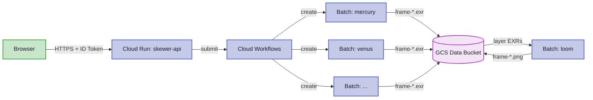
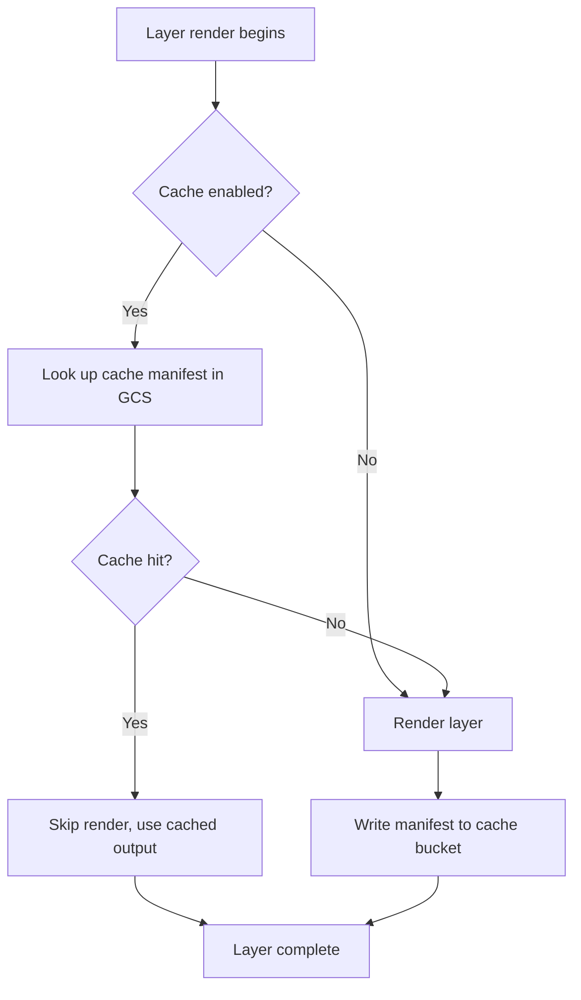

# Layer Compositing with Loom

Skewer's layered rendering system allows complex scenes to be split into independently rendered layers that are composited together afterward. This guide explains how the system works and how to use it effectively.

## Why Layers?

Rendering a scene in layers offers several advantages:

- **Parallel rendering** — Each layer is rendered independently on separate machines, dramatically reducing total render time
- **Independent re-rendering** — If only one element changes, only that layer needs re-rendering (via caching)
- **Creative flexibility** — Adjust the contribution of individual layers in post without re-rendering
- **Memory efficiency** — Each render worker only needs to hold one layer's geometry in memory

## Architecture



1. The workflow creates parallel Cloud Batch jobs — one per layer
2. Each worker renders its layer to a **deep EXR** file in GCS
3. After all layers complete, a loom compositing job merges them
4. The final composited PNG is written to the `composites/` directory

## Deep EXR Format

Each layer render produces a deep EXR file with 6 channels per sample:

| Channel | Description |
|---------|-------------|
| `R`, `G`, `B` | Premultiplied color (rgb × alpha) |
| `A` | Alpha (opacity at this depth sample) |
| `Z` | Front depth (distance to camera) |
| `ZBack` | Back depth (far side of this sample) |

**Premultiplied colors** mean the RGB values are already multiplied by alpha. This is essential for correct compositing: `over` operations use `C_out = C_A + C_B × (1 - alpha_A)`.

Deep EXR stores multiple samples per pixel at different depths, enabling accurate compositing of overlapping geometry from different layers — even when objects interleave in Z.

## How Loom Composites Layers

Loom uses **deep compositing** when deep EXR files are available:

### Step 1: Load

Each input deep EXR file is read row-by-row into memory. Samples are collected from all input files for each pixel.

### Step 2: Split and Sort

All samples from all layers are pooled together per pixel. The compositor:

1. **Gathers split points** — every unique `Z` and `ZBack` depth across all samples
2. **Splits volumetric samples** at each interior split point using Beer-Lambert exponential attenuation, ensuring samples from different layers align at depth boundaries
3. **Sorts fragments** by `(Z, ZBack)` — front to back
4. **Blends coincident fragments** that share the same depth interval using the Over operator:
   ```
   alpha_combined = alpha_A + alpha_B - alpha_A × alpha_B
   ```
   with premultiplied color renormalization to avoid over-brightening

### Step 3: Flatten

The sorted, split samples are composited front-to-back using the standard Over operator:
```
weight = 1.0 - accumulated_alpha
accumulated_color += sample_color × weight
accumulated_alpha += sample_alpha × weight
```

### Step 4: Output

Three outputs are produced:

| Output | File | Description |
|--------|------|-------------|
| Flat EXR | `<prefix>_flat.exr` | Single-layer EXR (flattened deep data) |
| PNG | `<prefix>.png` | Final composited image (gamma-corrected) |
| Merged deep EXR | `<prefix>_merged.exr` | Full deep data with all layers combined |

## Layer Ordering

In deep compositing, **layer input order does not affect the result** — all samples are sorted by depth (Z) and composited front-to-back regardless of which layer they came from. This is the key advantage of deep compositing over traditional 2D compositing: interpenetrating geometry from different layers is handled correctly.

!!! note "Render Configuration"
    Layer ordering still matters for **render configuration**. The first layer's render settings (resolution, integrator type) establish the output format. Later layers must match.

## Transparent Backgrounds

For compositing to work correctly, layers must use transparent backgrounds:

```json
"render": {
  "transparent_background": true,
  "visibility_depth": 1
}
```

When `transparent_background` is enabled:
- Rays that miss all geometry produce `alpha=0` instead of opaque black
- This allows subsequent layers to show through empty regions

The `visibility_depth` parameter controls how many surface bounces are checked for "covered" pixels:
- `1` (default): only the first surface hit must be visible
- `2-4`: allows seeing visible objects through invisible intermediate surfaces (e.g., a visible sphere reflected in an invisible mirror)

!!! important "Cloud Pipeline"
    In the cloud pipeline, `transparent_background` is **automatically set to `true`** for all layer renders. You do not need to set it manually when using the cloud renderer.

## Caching and Layer Skipping

The cloud workflow supports layer caching to skip unchanged renders:



A cache key is derived from the layer file content. If the file hasn't changed since the last render, the workflow reuses the previous output instead of re-rendering. This is controlled by `enable_cache` and `cache_key` fields in the workflow configuration.

## Manual Compositing with Loom

You can run loom manually for local compositing:

```bash
loom-worker \
  --input layer_mercury/frame-0001.exr \
          layer_venus/frame-0001.exr \
          layer_earth/frame-0001.exr \
  --output composited/frame-0001
```

All input files must be deep EXR. The output prefix determines the three output files (`_flat.exr`, `.png`, `_merged.exr`).

## Common Issues

### Missing Layers

If a layer render fails, the compositing step will also fail. The cloud workflow raises an error with the layer name and failure state. Check the failed Batch job logs to diagnose.

### Mismatched Resolutions

All layers must render at the same resolution. If one layer has a different `image.width` or `image.height`, the compositor will produce incorrect results or fail. Ensure the highest-priority layer (typically the first context or layer file) sets the resolution, or override it uniformly in the workflow configuration.

### NaN in Deep Samples

If a layer produces NaN values in its deep EXR output, the compositor will propagate them to the final image. Use the `normals` integrator on the problematic layer to check geometry, and verify material parameters (especially IOR and roughness on dielectrics).

## See Also

- [Scene Format](scene-format.md) — Layer file structure and render options
- [Rendering Tips](rendering-tips.md) — Quality and performance optimization
- [GCP Deployment](../deployment/gcp.md) — Cloud pipeline setup
